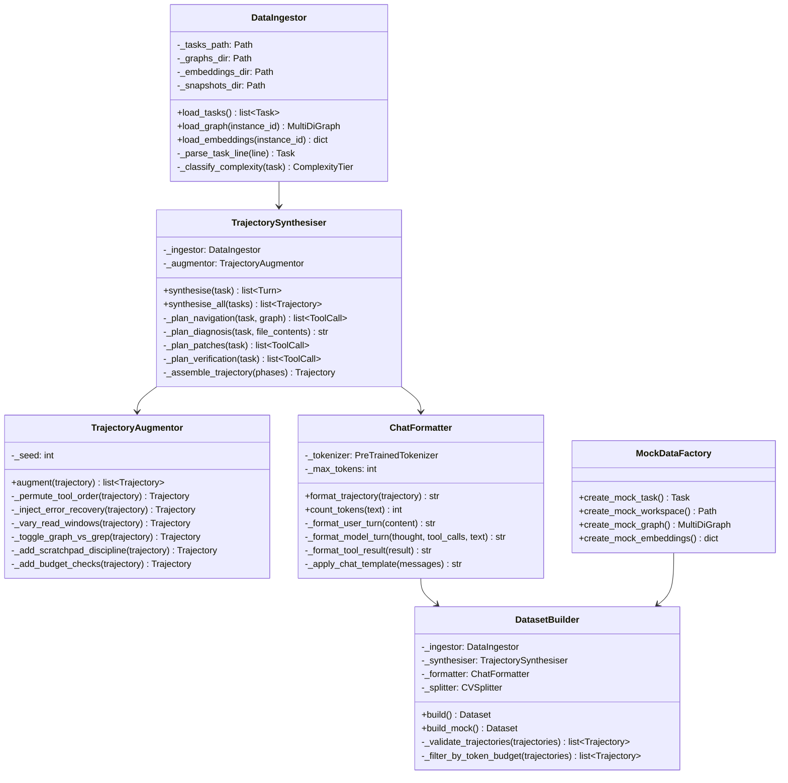

# Detailed Design 01 — Data Preprocessing Pipeline

---

## 1. Module Breakdown



---

## 2. Data Models

### 2.1 Core Data Types

```python
from dataclasses import dataclass
from enum import Enum

class ComplexityTier(Enum):
    SIMPLE = "SIMPLE"       # 1 file, <20 lines changed
    MODERATE = "MODERATE"   # 1-3 files, 20-100 lines
    COMPLEX = "COMPLEX"     # >3 files or >100 lines


@dataclass(frozen=True)
class Task:
    instance_id: str
    repo: str
    base_commit: str
    problem_statement: str
    hints_text: str
    patch: str
    test_patch: str
    created_at: str


@dataclass(frozen=True)
class FileChange:
    filepath: str
    hunks: list["Hunk"]


@dataclass(frozen=True)
class Hunk:
    old_start: int
    old_count: int
    new_start: int
    new_count: int
    old_lines: list[str]
    new_lines: list[str]


@dataclass(frozen=True)
class ToolCall:
    tool_name: str
    args: dict[str, object]


@dataclass(frozen=True)
class Turn:
    role: str                    # "user" | "model"
    thought: str | None          # Model thinking (within <|thought|> tags)
    text: str | None             # Model text response
    tool_calls: list[ToolCall]   # Tool calls (within <|tool_call|> tags)
    tool_result: str | None      # Tool result JSON (for user turns)


@dataclass
class Trajectory:
    instance_id: str
    repo: str
    complexity: ComplexityTier
    turns: list[Turn]
    token_count: int
    num_tool_calls: int
    num_files_changed: int
```

---

## 3. Trajectory Synthesis Algorithm

### 3.1 Gold Trajectory Construction

```python
class TrajectorySynthesiser:
    """Converts (problem, patch) pairs into multi-turn agent trajectories."""
    
    _MAX_TRAJECTORY_TOKENS: int = 28672
    _READ_CONTEXT_LINES: int = 30     # Lines of context around each hunk
    _MAX_OLD_STRING_LINES: int = 15   # Max lines in edit_file old_string
    
    def synthesise(self, task: Task) -> Trajectory:
        # 1. Parse the gold patch into structured file changes
        file_changes = self._parse_patch(task.patch)
        
        # 2. Load the code graph for navigation planning
        graph = self._ingestor.load_graph(task.instance_id)
        
        # 3. Identify key symbols from the patch
        changed_symbols = self._extract_symbols(file_changes, graph)
        
        turns: list[Turn] = []
        
        # 4. Initial user prompt (mirrors harness build_agent_prompt)
        turns.append(self._build_initial_prompt(task))
        
        # 5. Navigation phase
        turns.extend(self._synthesise_navigation(task, graph, changed_symbols))
        
        # 6. Diagnosis phase (model thinking + file reads)
        turns.extend(self._synthesise_diagnosis(task, file_changes))
        
        # 7. Patch phase (edit_file calls)
        turns.extend(self._synthesise_patches(task, file_changes))
        
        # 8. Verification phase (run_command pytest)
        turns.extend(self._synthesise_verification(task))
        
        # 9. Submission phase
        turns.extend(self._synthesise_submission(task))
        
        trajectory = Trajectory(
            instance_id=task.instance_id,
            repo=task.repo,
            complexity=self._classify(task),
            turns=turns,
            token_count=self._count_tokens(turns),
            num_tool_calls=sum(len(t.tool_calls) for t in turns),
            num_files_changed=len(file_changes),
        )
        
        return trajectory
```

### 3.2 Navigation Phase Synthesis

```python
def _synthesise_navigation(
    self, task: Task, graph: MultiDiGraph, symbols: list[str]
) -> list[Turn]:
    turns = []
    
    # Model decides to use code intelligence tools first
    turns.append(Turn(
        role="model",
        thought=(
            f"The problem mentions {self._extract_keywords(task.problem_statement)}. "
            f"Let me use the code intelligence tools to find the relevant code."
        ),
        text="Let me search for the relevant code in the repository.",
        tool_calls=[ToolCall(
            tool_name="search_similar_code",
            args={"query": symbols[0], "k": 5},
        )],
        tool_result=None,
    ))
    
    # Simulate tool result
    search_results = self._simulate_search(symbols[0], graph)
    turns.append(Turn(
        role="user",
        thought=None,
        text=None,
        tool_calls=[],
        tool_result=json.dumps(search_results),
    ))
    
    # Follow up with code neighbors
    if len(symbols) > 0:
        top_result = search_results["results"][0]["node_name"]
        turns.append(Turn(
            role="model",
            thought=f"Found {top_result}. Let me check its callers and callees.",
            text="Examining the call graph for this function.",
            tool_calls=[ToolCall(
                tool_name="get_code_neighbors",
                args={"node": top_result},
            )],
            tool_result=None,
        ))
        
        neighbors_result = self._simulate_neighbors(top_result, graph)
        turns.append(Turn(
            role="user", thought=None, text=None,
            tool_calls=[], tool_result=json.dumps(neighbors_result),
        ))
    
    return turns
```

### 3.3 Patch Phase Synthesis

```python
def _synthesise_patches(
    self, task: Task, file_changes: list[FileChange]
) -> list[Turn]:
    turns = []
    
    for fc in file_changes:
        for hunk in fc.hunks:
            # Build the edit_file call with precise old_string/new_string
            old_string = "\n".join(hunk.old_lines)
            new_string = "\n".join(hunk.new_lines)
            
            # Ensure old_string is focused (≤15 lines)
            if len(hunk.old_lines) > self._MAX_OLD_STRING_LINES:
                old_string, new_string = self._split_hunk(hunk)
            
            turns.append(Turn(
                role="model",
                thought=f"Fixing {fc.filepath} at line {hunk.old_start}.",
                text=f"Applying the fix to `{fc.filepath}`.",
                tool_calls=[ToolCall(
                    tool_name="edit_file",
                    args={
                        "filepath": fc.filepath,
                        "old_string": old_string,
                        "new_string": new_string,
                    },
                )],
                tool_result=None,
            ))
            
            # Simulate successful edit result
            turns.append(Turn(
                role="user", thought=None, text=None,
                tool_calls=[],
                tool_result=json.dumps({
                    "status": "ok",
                    "filepath": fc.filepath,
                    "occurrences": 1,
                    "strategy": "exact",
                }),
            ))
    
    return turns
```

---

## 4. Patch Parser

### 4.1 Unified Diff Parser

```python
class PatchParser:
    """Parses unified git diff into structured FileChange objects."""
    
    _DIFF_HEADER: str = "diff --git"
    _HUNK_HEADER_PATTERN: str = r"^@@\s+-(\d+)(?:,(\d+))?\s+\+(\d+)(?:,(\d+))?\s+@@"
    
    def parse(self, patch_text: str) -> list[FileChange]:
        files: list[FileChange] = []
        current_file: str | None = None
        hunks: list[Hunk] = []
        
        for line in patch_text.split("\n"):
            if line.startswith(self._DIFF_HEADER):
                if current_file:
                    files.append(FileChange(filepath=current_file, hunks=hunks))
                current_file = self._extract_filepath(line)
                hunks = []
            elif re.match(self._HUNK_HEADER_PATTERN, line):
                hunk = self._parse_hunk_header(line)
                hunks.append(hunk)
            elif hunks:
                self._accumulate_hunk_lines(hunks[-1], line)
        
        if current_file:
            files.append(FileChange(filepath=current_file, hunks=hunks))
        
        return files
```

---

## 5. Quality Validation Pipeline

### 5.1 Trajectory Validators

```python
class TrajectoryValidator:
    """Validates synthesised trajectories for training readiness."""
    
    _MAX_TOKENS: int = 28672
    _MAX_TOOL_CALLS: int = 80
    
    def validate(self, trajectory: Trajectory) -> ValidationResult:
        errors: list[str] = []
        warnings: list[str] = []
        
        # 1. Token budget
        if trajectory.token_count > self._MAX_TOKENS:
            errors.append(
                f"Token count {trajectory.token_count} exceeds {self._MAX_TOKENS}"
            )
        
        # 2. Tool call budget
        if trajectory.num_tool_calls > self._MAX_TOOL_CALLS:
            warnings.append(
                f"Tool calls {trajectory.num_tool_calls} exceeds recommended {self._MAX_TOOL_CALLS}"
            )
        
        # 3. Verify edit_file old_strings exist in source files
        for turn in trajectory.turns:
            for tc in turn.tool_calls:
                if tc.tool_name == "edit_file":
                    if not self._verify_old_string_exists(tc.args):
                        errors.append(
                            f"edit_file old_string not found in {tc.args['filepath']}"
                        )
        
        # 4. Check no test file modifications
        for turn in trajectory.turns:
            for tc in turn.tool_calls:
                if tc.tool_name in ("edit_file", "write_file"):
                    filepath = tc.args.get("filepath", "")
                    if self._is_test_file(filepath):
                        errors.append(f"Modifies test file: {filepath}")
        
        # 5. Check scratch files use /tmp/
        for turn in trajectory.turns:
            for tc in turn.tool_calls:
                if tc.tool_name == "write_file":
                    filepath = tc.args.get("filepath", "")
                    if self._is_scratch_file(filepath) and not filepath.startswith("/tmp"):
                        errors.append(f"Scratch file in /workspace: {filepath}")
        
        # 6. Verify submit_patch is the last tool call
        last_tool_turn = [t for t in trajectory.turns if t.tool_calls][-1]
        if last_tool_turn.tool_calls[-1].tool_name != "submit_patch":
            warnings.append("submit_patch is not the last tool call")
        
        return ValidationResult(
            valid=len(errors) == 0,
            errors=errors,
            warnings=warnings,
        )
```

---

## 6. Mock/Sample Mode

### 6.1 MockDataFactory

```python
class MockDataFactory:
    """Generates minimal test data for local pipeline validation."""
    
    _MOCK_SOURCE: str = textwrap.dedent("""\
        # utils.py
        
        def add_numbers(a, b):
            \"\"\"Add two numbers and return the result.\"\"\"
            return a + b + 1  # Bug: off-by-one error
    """)
    
    _MOCK_FIXED: str = textwrap.dedent("""\
        # utils.py
        
        def add_numbers(a, b):
            \"\"\"Add two numbers and return the result.\"\"\"
            return a + b
    """)
    
    def create_mock_task(self) -> Task:
        return Task(
            instance_id="mock_utils_001",
            repo="mock/utils-lib",
            base_commit="0" * 40,
            problem_statement=(
                "The add_numbers function has an off-by-one error. "
                "add_numbers(2, 3) returns 6 instead of 5."
            ),
            hints_text="Check the return statement.",
            patch=self._generate_patch(),
            test_patch=self._generate_test_patch(),
            created_at="2026-01-01T00:00:00Z",
        )
    
    def create_mock_workspace(self) -> Path:
        workspace = Path(tempfile.mkdtemp(prefix="mock_ws_"))
        (workspace / "utils.py").write_text(self._MOCK_SOURCE)
        (workspace / "__init__.py").write_text("")
        
        # Initialise minimal git repo
        subprocess.run(["git", "init"], cwd=workspace, capture_output=True)
        subprocess.run(["git", "add", "."], cwd=workspace, capture_output=True)
        subprocess.run(
            ["git", "commit", "-m", "baseline", "--allow-empty-message"],
            cwd=workspace, capture_output=True,
        )
        
        return workspace
```

### 6.2 Local Pipeline Validation

```python
class MockPipelineValidator:
    """Runs the full pipeline in mock mode to validate structure."""
    
    def validate_pipeline(self) -> bool:
        factory = MockDataFactory()
        
        # 1. Create mock data
        task = factory.create_mock_task()
        
        # 2. Synthesise trajectory
        synthesiser = TrajectorySynthesiser(mock_mode=True)
        trajectory = synthesiser.synthesise(task)
        
        # 3. Format with chat template
        formatter = ChatFormatter(tokenizer=None)  # Mock tokenizer
        formatted = formatter.format_trajectory(trajectory)
        
        # 4. Validate structure
        assert "<start_of_turn>" in formatted
        assert "<|tool_call|>" in formatted
        assert "submit_patch" in formatted
        
        # 5. Build mini dataset
        builder = DatasetBuilder(mock_mode=True)
        dataset = builder.build_mock()
        
        assert len(dataset) >= 1
        assert "messages" in dataset.column_names
        
        return True
```
