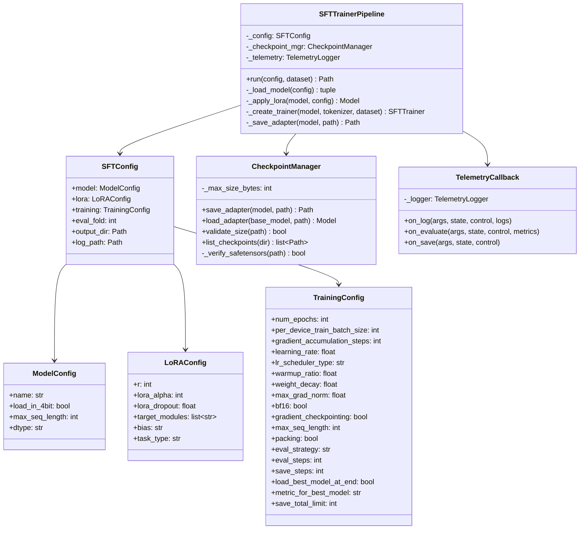

# Detailed Design 02 — SFT Training Pipeline

---

## 1. SFT Trainer Module Design



---

## 2. Full SFT Training Implementation

### 2.1 Pipeline Entry Point

```python
class SFTTrainerPipeline:
    """Orchestrates QLoRA SFT on gold trajectories using Unsloth + TRL."""
    
    _ADAPTER_SIZE_LIMIT: int = 1_500_000_000   # 1.5 GiB safety margin
    _MIN_EVAL_LOSS_IMPROVEMENT: float = 0.001
    
    def run(self, config: SFTConfig, dataset: Dataset) -> Path:
        """Execute complete SFT training pipeline."""
        self._telemetry.log_start("sft", config)
        
        # 1. Load base model with Unsloth 4-bit
        model, tokenizer = self._load_model(config.model)
        
        # 2. Apply LoRA adapters
        model = self._apply_lora(model, config.lora)
        
        # 3. Prepare data splits
        train_ds, val_ds = self._prepare_splits(dataset, config.eval_fold)
        
        # 4. Apply curriculum if enabled
        if config.training.curriculum_enabled:
            train_ds = self._apply_curriculum(train_ds, config.training)
        
        # 5. Create and run trainer
        trainer = self._create_trainer(model, tokenizer, train_ds, val_ds, config)
        train_result = trainer.train()
        
        # 6. Save best adapter
        adapter_path = self._save_adapter(model, config.output_dir / "sft_lora")
        
        # 7. Log final metrics
        self._telemetry.log_end("sft", {
            "final_train_loss": train_result.training_loss,
            "best_eval_loss": trainer.state.best_metric,
            "total_steps": trainer.state.global_step,
            "adapter_size_bytes": self._compute_size(adapter_path),
        })
        
        return adapter_path
```

### 2.2 Model Loading with Unsloth

```python
def _load_model(self, config: ModelConfig) -> tuple:
    """Load base model with Unsloth for 4-bit optimisation."""
    from unsloth import FastLanguageModel
    
    model, tokenizer = FastLanguageModel.from_pretrained(
        model_name=config.name,
        max_seq_length=config.max_seq_length,
        dtype=config.dtype,
        load_in_4bit=config.load_in_4bit,
        # Unsloth-specific optimisations
        device_map="auto",          # Distribute across 4 GPUs
        trust_remote_code=True,
    )
    
    # Verify tokenizer has required special tokens
    required_tokens = [
        "<start_of_turn>", "<end_of_turn>",
        "<|tool_call|>", "<|/tool_call|>",
        "<|thought|>", "<|/thought|>",
    ]
    for token in required_tokens:
        assert token in tokenizer.get_vocab(), f"Missing token: {token}"
    
    return model, tokenizer
```

### 2.3 LoRA Application

```python
def _apply_lora(self, model, config: LoRAConfig):
    """Apply QLoRA adapters targeting all linear projections."""
    from unsloth import FastLanguageModel
    
    model = FastLanguageModel.get_peft_model(
        model,
        r=config.r,
        lora_alpha=config.lora_alpha,
        lora_dropout=config.lora_dropout,
        target_modules=config.target_modules,
        bias=config.bias,
        use_gradient_checkpointing="unsloth",  # Unsloth optimised
        random_state=42,
        use_rslora=True,          # Rank-stabilised LoRA
        loftq_config=None,
    )
    
    # Log trainable parameters
    trainable, total = model.get_nb_trainable_parameters()
    self._telemetry.log_info(
        f"Trainable: {trainable:,} / {total:,} "
        f"({100 * trainable / total:.2f}%)"
    )
    
    return model
```

### 2.4 Trainer Construction

```python
def _create_trainer(
    self, model, tokenizer, train_ds, val_ds, config: SFTConfig
) -> SFTTrainer:
    """Configure TRL SFTTrainer with all hyperparameters."""
    from trl import SFTTrainer, SFTConfig as TRLSFTConfig
    
    training_args = TRLSFTConfig(
        output_dir=str(config.output_dir / "checkpoints"),
        
        # Epochs & batching
        num_train_epochs=config.training.num_epochs,
        per_device_train_batch_size=config.training.per_device_train_batch_size,
        per_device_eval_batch_size=config.training.per_device_train_batch_size,
        gradient_accumulation_steps=config.training.gradient_accumulation_steps,
        
        # Optimiser
        learning_rate=config.training.learning_rate,
        lr_scheduler_type=config.training.lr_scheduler_type,
        warmup_ratio=config.training.warmup_ratio,
        weight_decay=config.training.weight_decay,
        max_grad_norm=config.training.max_grad_norm,
        optim="adamw_8bit",  # Memory-efficient optimiser
        
        # Precision
        bf16=config.training.bf16,
        
        # Checkpointing
        gradient_checkpointing=config.training.gradient_checkpointing,
        gradient_checkpointing_kwargs={"use_reentrant": False},
        
        # Evaluation & saving
        eval_strategy=config.training.eval_strategy,
        eval_steps=config.training.eval_steps,
        save_strategy=config.training.save_strategy,
        save_steps=config.training.save_steps,
        load_best_model_at_end=config.training.load_best_model_at_end,
        metric_for_best_model=config.training.metric_for_best_model,
        greater_is_better=False,
        save_total_limit=config.training.save_total_limit,
        
        # Logging
        logging_steps=10,
        logging_first_step=True,
        report_to="none",
        
        # Sequence handling
        max_seq_length=config.training.max_seq_length,
        packing=config.training.packing,
        dataset_num_proc=4,
        
        # Reproducibility
        seed=42,
        data_seed=42,
    )
    
    trainer = SFTTrainer(
        model=model,
        tokenizer=tokenizer,
        train_dataset=train_ds,
        eval_dataset=val_ds,
        args=training_args,
        callbacks=[
            TelemetryCallback(self._telemetry),
            EarlyStoppingCallback(
                early_stopping_patience=3,
                early_stopping_threshold=self._MIN_EVAL_LOSS_IMPROVEMENT,
            ),
        ],
    )
    
    return trainer
```

### 2.5 Adapter Saving

```python
def _save_adapter(self, model, adapter_path: Path) -> Path:
    """Save adapter in safetensors format with size validation."""
    adapter_path.mkdir(parents=True, exist_ok=True)
    
    # Save using PEFT's safetensors serialisation
    model.save_pretrained(
        adapter_path,
        safe_serialization=True,  # MUST be True — .bin/.pt rejected
    )
    
    # Verify files exist
    assert (adapter_path / "adapter_config.json").exists(), \
        "Missing adapter_config.json"
    assert (adapter_path / "adapter_model.safetensors").exists(), \
        "Missing adapter_model.safetensors"
    
    # Verify no forbidden formats leaked
    for forbidden in ("*.bin", "*.pt", "*.pth"):
        matches = list(adapter_path.glob(forbidden))
        assert len(matches) == 0, f"Forbidden file found: {matches}"
    
    # Validate size
    total_size = sum(f.stat().st_size for f in adapter_path.rglob("*"))
    assert total_size < self._ADAPTER_SIZE_LIMIT, \
        f"Adapter size {total_size:,} bytes exceeds limit {self._ADAPTER_SIZE_LIMIT:,}"
    
    self._telemetry.log_info(f"Adapter saved: {total_size:,} bytes at {adapter_path}")
    
    return adapter_path
```

---

## 3. Curriculum Training Implementation

### 3.1 Epoch-Based Curriculum

```python
class CurriculumScheduler:
    """Implements curriculum learning by complexity tier."""
    
    def get_epoch_data(self, dataset: Dataset, epoch: int, total_epochs: int) -> Dataset:
        """Return filtered dataset for the current epoch's curriculum stage."""
        
        progress = epoch / total_epochs
        
        if progress < 0.4:
            # Early: Only SIMPLE tasks
            return dataset.filter(lambda x: x["complexity"] == "SIMPLE")
        
        elif progress < 0.8:
            # Middle: SIMPLE + MODERATE
            return dataset.filter(
                lambda x: x["complexity"] in ("SIMPLE", "MODERATE")
            )
        
        else:
            # Late: All complexity tiers
            return dataset
```

### 3.2 Custom Data Collator

```python
class TrajectoryCollator:
    """Custom collator that handles multi-turn trajectory formatting."""
    
    def __init__(self, tokenizer, max_length: int):
        self._tokenizer = tokenizer
        self._max_length = max_length
    
    def __call__(self, examples: list[dict]) -> dict:
        # Each example has a "formatted_text" field with the full trajectory
        texts = [ex["formatted_text"] for ex in examples]
        
        # Tokenize with padding and truncation
        batch = self._tokenizer(
            texts,
            padding=True,
            truncation=True,
            max_length=self._max_length,
            return_tensors="pt",
        )
        
        # Create labels (shift right for causal LM)
        batch["labels"] = batch["input_ids"].clone()
        
        # Mask padding tokens in labels
        batch["labels"][batch["attention_mask"] == 0] = -100
        
        # CRITICAL: Mask user turns and tool results in labels
        # Only train on model outputs (thought + text + tool_calls)
        for i, text in enumerate(texts):
            self._mask_non_model_tokens(batch, i, text)
        
        return batch
    
    def _mask_non_model_tokens(self, batch, idx: int, text: str) -> None:
        """Mask everything except model turns in the loss computation."""
        # Find <start_of_turn>model and <end_of_turn> boundaries
        # Set labels to -100 for all non-model-turn tokens
        # This ensures we only train on model-generated content
        ...
```

---

## 4. Training Monitoring

### 4.1 TelemetryCallback

```python
class TelemetryCallback(TrainerCallback):
    """Custom callback for structured training telemetry."""
    
    def __init__(self, logger: TelemetryLogger):
        self._logger = logger
    
    def on_log(self, args, state, control, logs=None, **kwargs):
        if logs:
            self._logger.log_metrics({
                "phase": "sft",
                "step": state.global_step,
                "epoch": state.epoch,
                "train_loss": logs.get("loss"),
                "learning_rate": logs.get("learning_rate"),
                "grad_norm": logs.get("grad_norm"),
            })
    
    def on_evaluate(self, args, state, control, metrics=None, **kwargs):
        if metrics:
            self._logger.log_metrics({
                "phase": "sft_eval",
                "step": state.global_step,
                "epoch": state.epoch,
                "eval_loss": metrics.get("eval_loss"),
                "eval_runtime": metrics.get("eval_runtime"),
            })
            
            # Log GPU memory usage
            import torch
            for i in range(torch.cuda.device_count()):
                allocated = torch.cuda.memory_allocated(i) / 1e9
                self._logger.log_metrics({
                    f"gpu_{i}_memory_gb": allocated,
                })
    
    def on_save(self, args, state, control, **kwargs):
        self._logger.log_info(
            f"Checkpoint saved at step {state.global_step}, "
            f"best metric: {state.best_metric}"
        )
```

---

## 5. Configuration File (`configs/sft_config.yaml`)

```yaml
# SFT Training Configuration
# Version: 1.0.0

model:
  # Kaggle offline model path (or "google/gemma-4-31b-it-qat-w4a16-ct" resolved via ModelPathResolver)
  name: "/kaggle/input/models/google/gemma-4/other/gemma-4-31b-it-qat-w4a16-ct/2"
  load_in_4bit: true
  max_seq_length: 32768
  dtype: "bfloat16"

lora:
  r: 32
  lora_alpha: 64
  lora_dropout: 0.05
  target_modules:
    - q_proj
    - k_proj
    - v_proj
    - o_proj
    - gate_proj
    - up_proj
    - down_proj
  bias: "none"
  task_type: "CAUSAL_LM"

training:
  num_epochs: 5
  per_device_train_batch_size: 1
  gradient_accumulation_steps: 8
  learning_rate: 2.0e-4
  lr_scheduler_type: "cosine"
  warmup_ratio: 0.05
  weight_decay: 0.01
  max_grad_norm: 1.0
  bf16: true
  gradient_checkpointing: true
  max_seq_length: 28672
  packing: true
  eval_strategy: "steps"
  eval_steps: 50
  save_strategy: "steps"
  save_steps: 50
  load_best_model_at_end: true
  metric_for_best_model: "eval_loss"
  save_total_limit: 3
  curriculum_enabled: true

eval_fold: 0  # Hold out fastapi for validation
output_dir: "/kaggle/working/checkpoints"
log_path: "/kaggle/working/logs/run_sft.log"

# Data paths (Kaggle)
data:
  tasks_path: "/kaggle/input/gemma-4-developer-agent/published/tasks.jsonl"
  graphs_dir: "/kaggle/input/gemma-4-developer-agent/published/graphs"
  embeddings_dir: "/kaggle/input/gemma-4-developer-agent/published/embeddings"
  snapshots_dir: "/kaggle/input/gemma-4-developer-agent/published/snapshots"
```
