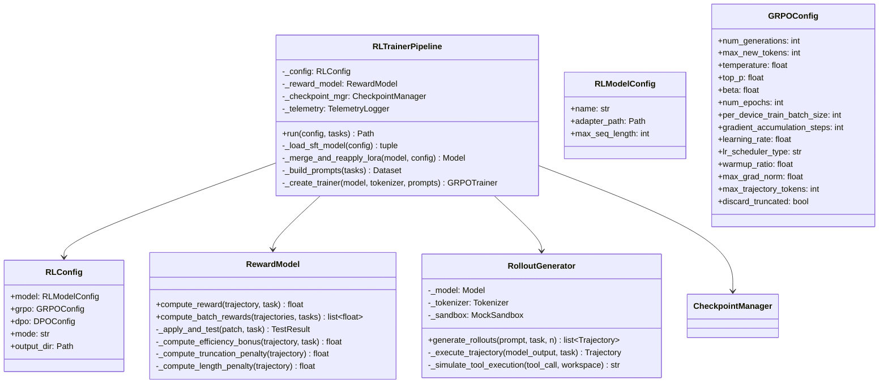

# Detailed Design 03 — RL Training Pipeline

---

## 1. RL Trainer Module Design



---

## 2. GRPO Training Implementation

### 2.1 Pipeline Entry Point

```python
class RLTrainerPipeline:
    """GRPO/DPO reinforcement learning on agent trajectories."""
    
    _ADAPTER_SIZE_LIMIT: int = 1_500_000_000
    
    def run(self, config: RLConfig, tasks: list[Task]) -> Path:
        self._telemetry.log_start("rl", config)
        
        # 1. Load SFT-trained model and merge adapter
        model, tokenizer = self._load_sft_model(config.model)
        
        # 2. Re-apply fresh LoRA for RL training
        model = self._merge_and_reapply_lora(model, config)
        
        # 3. Build training prompts from tasks
        prompt_dataset = self._build_prompts(tasks)
        
        # 4. Select training mode
        if config.mode == "grpo":
            adapter_path = self._train_grpo(model, tokenizer, prompt_dataset, config)
        elif config.mode == "dpo":
            adapter_path = self._train_dpo(model, tokenizer, prompt_dataset, config)
        else:
            raise ValueError(f"Unknown RL mode: {config.mode}")
        
        # 5. Log final metrics
        self._telemetry.log_end("rl", {
            "mode": config.mode,
            "adapter_size_bytes": self._compute_size(adapter_path),
        })
        
        return adapter_path
```

### 2.2 SFT Model Loading and LoRA Re-Application

```python
def _load_sft_model(self, config: RLModelConfig) -> tuple:
    """Load base model with SFT adapter merged."""
    from unsloth import FastLanguageModel
    from peft import PeftModel
    
    # Load base model
    model, tokenizer = FastLanguageModel.from_pretrained(
        model_name=config.name,
        max_seq_length=config.max_seq_length,
        load_in_4bit=True,
        dtype="bfloat16",
    )
    
    # Load and merge SFT adapter
    model = PeftModel.from_pretrained(model, str(config.adapter_path))
    model = model.merge_and_unload()
    
    self._telemetry.log_info("SFT adapter merged into base model")
    
    return model, tokenizer

def _merge_and_reapply_lora(self, model, config: RLConfig):
    """Apply fresh LoRA for RL training on top of merged SFT model."""
    from unsloth import FastLanguageModel
    
    model = FastLanguageModel.get_peft_model(
        model,
        r=config.grpo.lora_r if hasattr(config.grpo, 'lora_r') else 32,
        lora_alpha=64,
        lora_dropout=0.05,
        target_modules=[
            "q_proj", "k_proj", "v_proj", "o_proj",
            "gate_proj", "up_proj", "down_proj",
        ],
        use_gradient_checkpointing="unsloth",
        random_state=42,
    )
    
    return model
```

### 2.3 GRPO Training

```python
def _train_grpo(
    self, model, tokenizer, prompt_dataset: Dataset, config: RLConfig
) -> Path:
    """Train with Group Relative Policy Optimisation."""
    from trl import GRPOTrainer, GRPOConfig as TRLGRPOConfig
    
    # Configure GRPO
    grpo_config = TRLGRPOConfig(
        output_dir=str(config.output_dir / "grpo_checkpoints"),
        
        # Generation
        num_generations=config.grpo.num_generations,
        max_new_tokens=config.grpo.max_new_tokens,
        temperature=config.grpo.temperature,
        top_p=config.grpo.top_p,
        
        # KL penalty
        beta=config.grpo.beta,
        
        # Training
        num_train_epochs=config.grpo.num_epochs,
        per_device_train_batch_size=config.grpo.per_device_train_batch_size,
        gradient_accumulation_steps=config.grpo.gradient_accumulation_steps,
        learning_rate=config.grpo.learning_rate,
        lr_scheduler_type=config.grpo.lr_scheduler_type,
        warmup_ratio=config.grpo.warmup_ratio,
        max_grad_norm=config.grpo.max_grad_norm,
        
        # Precision
        bf16=True,
        
        # Logging
        logging_steps=5,
        report_to="none",
        
        # Saving
        save_strategy="steps",
        save_steps=25,
        save_total_limit=2,
        
        # Reproducibility
        seed=42,
    )
    
    # Create reward function
    reward_fn = self._reward_model.compute_reward
    
    # Create trainer
    trainer = GRPOTrainer(
        model=model,
        tokenizer=tokenizer,
        reward_funcs=[reward_fn],
        args=grpo_config,
        train_dataset=prompt_dataset,
        callbacks=[
            TelemetryCallback(self._telemetry),
            RLEarlyStoppingCallback(
                min_reward_improvement=0.01,
                patience=5,
            ),
        ],
    )
    
    # Train
    trainer.train()
    
    # Save adapter
    adapter_path = config.output_dir / "rl_lora"
    model.save_pretrained(adapter_path, safe_serialization=True)
    
    return adapter_path
```

---

## 3. Reward Model Design

### 3.1 Multi-Signal Reward Function

```python
class RewardModel:
    """Computes rewards for agent trajectories based on multiple signals."""
    
    # Outcome rewards
    _PASS_REWARD: float = 1.0
    _FAIL_REWARD: float = -0.5
    _NO_PATCH_PENALTY: float = -1.0
    
    # Partial credit
    _PARTIAL_PASS_WEIGHT: float = 0.5
    
    # Behavioural bonuses/penalties
    _EFFICIENCY_BONUS_MAX: float = 0.15
    _TRUNCATION_PENALTY: float = -0.2
    _SCRATCH_IN_WORKSPACE_PENALTY: float = -0.3
    _TEST_MODIFICATION_PENALTY: float = -0.5
    _LENGTH_PENALTY_THRESHOLD: int = 24000
    
    def compute_reward(self, trajectory: Trajectory, task: Task) -> float:
        """Compute composite reward for a single trajectory."""
        components: dict[str, float] = {}
        
        # 1. Outcome signal (primary)
        outcome = self._compute_outcome_reward(trajectory, task)
        components["outcome"] = outcome
        
        # 2. Efficiency signal
        efficiency = self._compute_efficiency_bonus(trajectory, task)
        components["efficiency"] = efficiency
        
        # 3. Behavioural penalties
        penalties = self._compute_behaviour_penalties(trajectory)
        components["penalties"] = penalties
        
        # 4. Length regularisation
        length_penalty = self._compute_length_penalty(trajectory)
        components["length_penalty"] = length_penalty
        
        total = sum(components.values())
        
        # Clamp to [-1.5, 1.3]
        total = max(-1.5, min(1.3, total))
        
        self._telemetry.log_reward(trajectory.instance_id, components, total)
        
        return total
    
    def _compute_outcome_reward(self, trajectory: Trajectory, task: Task) -> float:
        """Binary pass/fail from pytest execution."""
        if not trajectory.patch:
            return self._NO_PATCH_PENALTY
        
        test_result = self._apply_and_test(trajectory.patch, task)
        
        if test_result.all_pass:
            return self._PASS_REWARD
        elif test_result.some_pass:
            # Partial credit proportional to tests passed
            ratio = test_result.passed / test_result.total
            return self._PARTIAL_PASS_WEIGHT * ratio
        else:
            return self._FAIL_REWARD
    
    def _compute_efficiency_bonus(self, trajectory: Trajectory, task: Task) -> float:
        """Reward efficient tool usage."""
        # Median tool calls for this complexity tier
        median = self._get_median_tool_calls(task.complexity)
        
        if trajectory.num_tool_calls < median * 0.7:
            return self._EFFICIENCY_BONUS_MAX
        elif trajectory.num_tool_calls < median:
            # Linear interpolation
            ratio = 1.0 - (trajectory.num_tool_calls / median)
            return self._EFFICIENCY_BONUS_MAX * ratio
        else:
            return 0.0
    
    def _compute_behaviour_penalties(self, trajectory: Trajectory) -> float:
        """Penalise undesirable agent behaviours."""
        penalty = 0.0
        
        # Truncation
        if trajectory.had_truncation:
            penalty += self._TRUNCATION_PENALTY
        
        # Scratch files in /workspace
        for turn in trajectory.turns:
            for tc in turn.tool_calls:
                if tc.tool_name == "write_file":
                    path = tc.args.get("filepath", "")
                    if not path.startswith("/tmp") and self._is_scratch(path):
                        penalty += self._SCRATCH_IN_WORKSPACE_PENALTY
        
        # Test file modification
        for turn in trajectory.turns:
            for tc in turn.tool_calls:
                if tc.tool_name in ("edit_file", "write_file"):
                    path = tc.args.get("filepath", "")
                    if self._is_test_file(path):
                        penalty += self._TEST_MODIFICATION_PENALTY
        
        return penalty
    
    def _compute_length_penalty(self, trajectory: Trajectory) -> float:
        """Penalise excessively long trajectories."""
        if trajectory.token_count > self._LENGTH_PENALTY_THRESHOLD:
            excess = (trajectory.token_count - self._LENGTH_PENALTY_THRESHOLD) / 4000
            return -0.1 * excess ** 2
        return 0.0
```

### 3.2 Test Execution for Reward Computation

```python
def _apply_and_test(self, patch: str, task: Task) -> TestResult:
    """Apply patch and run tests in sandboxed environment."""
    sandbox = self._sandbox_pool.acquire()
    
    try:
        # 1. Setup workspace from snapshot
        sandbox.setup_workspace(task)
        
        # 2. Apply agent patch
        apply_success = sandbox.apply_patch(patch)
        if not apply_success:
            return TestResult(all_pass=False, passed=0, total=0, error="Patch failed")
        
        # 3. Reset test files (replicate harness anti-tampering)
        sandbox.reset_protected_files(task)
        
        # 4. Apply test_patch
        sandbox.apply_patch(task.test_patch)
        
        # 5. Run pytest
        result = sandbox.run_command(
            f"cd /workspace && python -m pytest {self._get_test_targets(task)} "
            f"--junitxml=/tmp/junit.xml -q",
            timeout=120,
        )
        
        # 6. Parse JUnit XML
        return self._parse_junit(result)
    
    finally:
        sandbox.cleanup()
        self._sandbox_pool.release(sandbox)
```

---

## 4. DPO Alternative Implementation

### 4.1 Preference Pair Generation

```python
class PreferencePairGenerator:
    """Generates (chosen, rejected) trajectory pairs for DPO."""
    
    def generate_pairs(
        self, tasks: list[Task], model, tokenizer, n_per_task: int = 4
    ) -> Dataset:
        pairs = []
        
        for task in tasks:
            # Generate multiple completions
            completions = self._generate_completions(model, tokenizer, task, n_per_task)
            
            # Score each completion
            scored = [(c, self._reward_model.compute_reward(c, task)) for c in completions]
            scored.sort(key=lambda x: x[1], reverse=True)
            
            # Create pairwise preferences
            for i in range(len(scored)):
                for j in range(i + 1, len(scored)):
                    chosen, chosen_score = scored[i]
                    rejected, rejected_score = scored[j]
                    
                    # Only create pair if meaningful score difference
                    if chosen_score - rejected_score > 0.3:
                        pairs.append({
                            "instance_id": task.instance_id,
                            "prompt": self._build_prompt(task),
                            "chosen": chosen.formatted_text,
                            "rejected": rejected.formatted_text,
                            "chosen_score": chosen_score,
                            "rejected_score": rejected_score,
                        })
        
        return Dataset.from_list(pairs)
```

### 4.2 DPO Training

```python
def _train_dpo(
    self, model, tokenizer, preference_dataset: Dataset, config: RLConfig
) -> Path:
    """Train with Direct Preference Optimisation."""
    from trl import DPOTrainer, DPOConfig as TRLDPOConfig
    
    dpo_config = TRLDPOConfig(
        output_dir=str(config.output_dir / "dpo_checkpoints"),
        beta=config.dpo.beta,
        loss_type=config.dpo.loss_type,
        max_length=config.dpo.max_length,
        max_prompt_length=config.dpo.max_prompt_length,
        num_train_epochs=config.dpo.num_epochs,
        per_device_train_batch_size=config.dpo.per_device_train_batch_size,
        gradient_accumulation_steps=config.dpo.gradient_accumulation_steps,
        learning_rate=config.dpo.learning_rate,
        bf16=True,
        logging_steps=5,
        save_strategy="steps",
        save_steps=25,
        save_total_limit=2,
        seed=42,
    )
    
    trainer = DPOTrainer(
        model=model,
        ref_model=None,  # Use implicit reference with PEFT
        tokenizer=tokenizer,
        args=dpo_config,
        train_dataset=preference_dataset,
        callbacks=[TelemetryCallback(self._telemetry)],
    )
    
    trainer.train()
    
    adapter_path = config.output_dir / "rl_lora"
    model.save_pretrained(adapter_path, safe_serialization=True)
    
    return adapter_path
```

---

## 5. RL Configuration File (`configs/rl_config.yaml`)

```yaml
# RL Training Configuration
# Version: 1.0.0

model:
  # Kaggle offline model path (or "google/gemma-4-31b-it-qat-w4a16-ct" resolved via ModelPathResolver)
  name: "/kaggle/input/models/google/gemma-4/other/gemma-4-31b-it-qat-w4a16-ct/2"
  adapter_path: "/kaggle/working/checkpoints/sft_lora"
  max_seq_length: 32768

mode: "grpo"  # "grpo" or "dpo"

grpo:
  # Generation
  num_generations: 4
  max_new_tokens: 16384
  temperature: 0.7
  top_p: 0.95
  lora_r: 32
  
  # KL penalty
  beta: 0.1
  
  # Training
  num_epochs: 2
  per_device_train_batch_size: 1
  gradient_accumulation_steps: 4
  learning_rate: 5.0e-5
  lr_scheduler_type: "cosine"
  warmup_ratio: 0.1
  max_grad_norm: 0.5
  
  # Safety
  max_trajectory_tokens: 28672
  discard_truncated: true

dpo:
  beta: 0.1
  loss_type: "sigmoid"
  max_length: 28672
  max_prompt_length: 4096
  num_epochs: 2
  per_device_train_batch_size: 1
  gradient_accumulation_steps: 4
  learning_rate: 5.0e-6

# Reward model
reward:
  pass_reward: 1.0
  fail_reward: -0.5
  efficiency_bonus_max: 0.15
  truncation_penalty: -0.2
  length_penalty_threshold: 24000

output_dir: "/kaggle/working/checkpoints"
log_path: "/kaggle/working/logs/run_rl.log"
```

---

## 6. Decision Framework: GRPO vs DPO

| Criterion | GRPO | DPO |
|---|---|---|
| **Compute cost** | High (on-policy rollouts) | Lower (offline preferences) |
| **Sample efficiency** | Lower | Higher |
| **Exploration** | Natural (sampling) | Limited to pre-generated pairs |
| **Alignment quality** | Better for complex tasks | Good for clear preferences |
| **Implementation** | TRL `GRPOTrainer` | TRL `DPOTrainer` |
| **Risk** | Reward hacking | Distributional shift |

**Recommendation**:
1. **Start with GRPO** if Kaggle GPU budget allows rollout generation
2. **Fall back to DPO** if GRPO is too slow or OOMs
3. **Combine**: Use DPO for initial RL, then GRPO for final refinement
