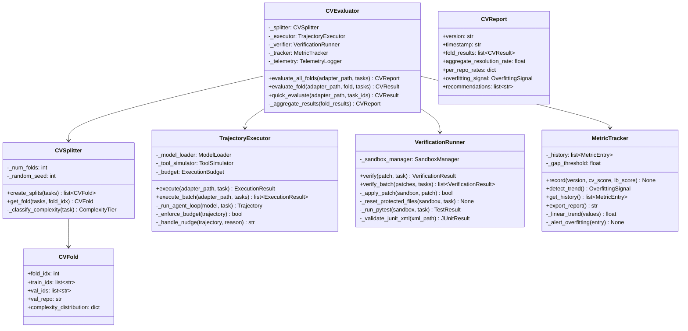

# Detailed Design 04 — CV Evaluator Pipeline

---

## 1. CV Evaluator Module Design



---

## 2. Full CV Evaluation Pipeline

### 2.1 All-Folds Evaluation

```python
class CVEvaluator:
    """End-to-end cross-validation engine for agent checkpoints."""
    
    _MIN_RESOLUTION_RATE: float = 0.10  # Minimum viable score
    
    def evaluate_all_folds(
        self, adapter_path: Path, tasks: list[Task], version: str
    ) -> CVReport:
        """Run evaluation across all K folds."""
        folds = self._splitter.create_splits(tasks)
        fold_results: list[CVResult] = []
        
        for fold in folds:
            self._telemetry.log_info(
                f"Evaluating fold {fold.fold_idx} (val_repo={fold.val_repo})"
            )
            result = self.evaluate_fold(adapter_path, fold, tasks)
            fold_results.append(result)
            
            self._telemetry.log_metrics({
                "phase": "cv",
                "fold": fold.fold_idx,
                "val_repo": fold.val_repo,
                "resolution_rate": result.resolution_rate,
                "avg_tool_calls": result.avg_tool_calls,
                "avg_tokens": result.avg_tokens,
                "truncation_rate": result.truncation_rate,
            })
        
        report = self._aggregate_results(fold_results, version)
        
        # Record in metric tracker
        self._tracker.record(version, report.aggregate_resolution_rate, lb_score=None)
        
        return report
    
    def evaluate_fold(
        self, adapter_path: Path, fold: CVFold, tasks: list[Task]
    ) -> CVResult:
        """Evaluate a single fold."""
        val_tasks = [t for t in tasks if t.instance_id in set(fold.val_ids)]
        task_results: list[TaskResult] = []
        
        for task in val_tasks:
            # Phase 1: Execute agent
            exec_result = self._executor.execute(
                adapter_path=adapter_path,
                task=task,
            )
            
            # Phase 2: Verify patch
            if exec_result.patch and exec_result.patch.strip():
                verif_result = self._verifier.verify(
                    patch=exec_result.patch,
                    task=task,
                )
            else:
                verif_result = VerificationResult(
                    resolved=False, error="No patch generated"
                )
            
            task_results.append(TaskResult(
                instance_id=task.instance_id,
                repo=task.repo,
                complexity=self._splitter._classify_complexity(task),
                resolved=verif_result.resolved,
                patch_size=len(exec_result.patch) if exec_result.patch else 0,
                tool_calls_used=exec_result.num_tool_calls,
                tokens_used=exec_result.total_tokens,
                had_truncation=exec_result.had_truncation,
                time_seconds=exec_result.elapsed_seconds,
                error=verif_result.error,
            ))
        
        # Compute aggregate metrics
        resolved_count = sum(1 for r in task_results if r.resolved)
        total_count = len(task_results)
        
        return CVResult(
            fold_idx=fold.fold_idx,
            val_repo=fold.val_repo,
            resolution_rate=resolved_count / total_count if total_count > 0 else 0.0,
            resolved_count=resolved_count,
            total_count=total_count,
            per_task_results=task_results,
            avg_tool_calls=self._mean([r.tool_calls_used for r in task_results]),
            avg_tokens=self._mean([r.tokens_used for r in task_results]),
            truncation_rate=self._mean([float(r.had_truncation) for r in task_results]),
            per_complexity={
                tier: self._compute_tier_rate(task_results, tier)
                for tier in ComplexityTier
            },
        )
```

### 2.2 Quick Evaluation Mode

```python
def quick_evaluate(
    self, adapter_path: Path, task_ids: list[str], tasks: list[Task]
) -> CVResult:
    """Fast evaluation on a subset of specific tasks."""
    subset = [t for t in tasks if t.instance_id in set(task_ids)]
    
    task_results = []
    for task in subset:
        exec_result = self._executor.execute(adapter_path, task)
        
        if exec_result.patch:
            verif_result = self._verifier.verify(exec_result.patch, task)
        else:
            verif_result = VerificationResult(resolved=False)
        
        task_results.append(TaskResult(
            instance_id=task.instance_id,
            repo=task.repo,
            resolved=verif_result.resolved,
            tool_calls_used=exec_result.num_tool_calls,
            tokens_used=exec_result.total_tokens,
        ))
    
    resolved = sum(1 for r in task_results if r.resolved)
    return CVResult(
        fold_idx=-1,
        val_repo="mixed",
        resolution_rate=resolved / len(task_results),
        resolved_count=resolved,
        total_count=len(task_results),
        per_task_results=task_results,
    )
```

---

## 3. Aggregation and Reporting

### 3.1 Report Generation

```python
def _aggregate_results(
    self, fold_results: list[CVResult], version: str
) -> CVReport:
    """Aggregate per-fold results into final CV report."""
    # Weighted average by fold size
    total_resolved = sum(r.resolved_count for r in fold_results)
    total_tasks = sum(r.total_count for r in fold_results)
    aggregate_rate = total_resolved / total_tasks if total_tasks > 0 else 0.0
    
    # Per-repo breakdown
    per_repo = {r.val_repo: r.resolution_rate for r in fold_results}
    
    # Per-complexity breakdown
    all_task_results = []
    for r in fold_results:
        all_task_results.extend(r.per_task_results)
    
    per_complexity = {
        tier.value: self._compute_tier_rate(all_task_results, tier)
        for tier in ComplexityTier
    }
    
    # Overfitting check
    signal = self._tracker.detect_trend()
    
    # Generate recommendations
    recommendations = self._generate_recommendations(
        aggregate_rate, per_repo, per_complexity, fold_results
    )
    
    return CVReport(
        version=version,
        timestamp=datetime.utcnow().isoformat(),
        fold_results=fold_results,
        aggregate_resolution_rate=aggregate_rate,
        per_repo_rates=per_repo,
        per_complexity_rates=per_complexity,
        overfitting_signal=signal,
        recommendations=recommendations,
        total_resolved=total_resolved,
        total_tasks=total_tasks,
    )

def _generate_recommendations(
    self, rate: float, per_repo: dict, per_complexity: dict,
    fold_results: list[CVResult]
) -> list[str]:
    """Generate actionable recommendations based on CV results."""
    recs = []
    
    # Low overall rate
    if rate < 0.20:
        recs.append(
            "CRITICAL: Resolution rate below 20%. Focus on SFT data quality "
            "and tool-call syntax accuracy before RL training."
        )
    
    # Repo-specific weakness
    min_repo = min(per_repo, key=per_repo.get)
    if per_repo[min_repo] < rate * 0.5:
        recs.append(
            f"WARNING: {min_repo} resolution rate ({per_repo[min_repo]:.1%}) is "
            f"significantly below average ({rate:.1%}). Add more diverse "
            f"training trajectories for this repo type."
        )
    
    # Complexity gap
    if per_complexity.get("COMPLEX", 0) < per_complexity.get("SIMPLE", 0) * 0.3:
        recs.append(
            "WARNING: Complex tasks resolve at <30% of simple task rate. "
            "Increase multi-file trajectory training and raise tool budget."
        )
    
    # High truncation
    avg_trunc = self._mean([r.truncation_rate for r in fold_results])
    if avg_trunc > 0.05:
        recs.append(
            f"WARNING: Truncation rate {avg_trunc:.1%} exceeds 5% threshold. "
            f"Reduce thinking_budget or split edit_file payloads."
        )
    
    # High tool usage
    avg_tools = self._mean([r.avg_tool_calls for r in fold_results])
    if avg_tools > 60:
        recs.append(
            f"WARNING: Average tool usage ({avg_tools:.0f}) is high. "
            f"Add efficiency bonus to RL reward signal."
        )
    
    return recs
```

### 3.2 Report Output Format

```json
{
  "version": "0.2.0",
  "timestamp": "2026-09-30T12:00:00Z",
  "aggregate_resolution_rate": 0.341,
  "total_resolved": 44,
  "total_tasks": 129,
  "per_repo_rates": {
    "fastapi": 0.314,
    "rich": 0.400,
    "requests": 0.350,
    "httpx": 0.300
  },
  "per_complexity_rates": {
    "SIMPLE": 0.520,
    "MODERATE": 0.310,
    "COMPLEX": 0.120
  },
  "overfitting_signal": "NONE",
  "fold_results": [
    {
      "fold_idx": 0,
      "val_repo": "fastapi",
      "resolution_rate": 0.314,
      "resolved_count": 22,
      "total_count": 70,
      "avg_tool_calls": 42.3,
      "avg_tokens": 19500,
      "truncation_rate": 0.029
    }
  ],
  "recommendations": [
    "WARNING: httpx resolution rate (30.0%) is below average. Add diverse trajectories.",
    "WARNING: Complex tasks resolve at 23% of simple task rate. Increase multi-file training."
  ]
}
```

---

## 4. Execution Budget Simulator

### 4.1 Budget Enforcement

```python
class ExecutionBudget:
    """Replicates the swegemma budget enforcement exactly."""
    
    _DEFAULT_MAX_TOOL_CALLS: int = 100
    _DEFAULT_MAX_TIME_MINUTES: float = 60.0
    _DEFAULT_MAX_TURNS: int = 500
    _DEFAULT_COMMAND_TIMEOUT: int = 300
    _MAX_STDOUT_CHARS: int = 5000
    _MAX_FILE_LINES: int = 150
    _MAX_FILE_CHARS: int = 10000
    _MAX_NUDGES: int = 3
    
    def __init__(self, overrides: dict | None = None):
        self._tool_calls_used: int = 0
        self._max_tool_calls = overrides.get(
            "max_tool_calls", self._DEFAULT_MAX_TOOL_CALLS
        ) if overrides else self._DEFAULT_MAX_TOOL_CALLS
        self._start_time = time.time()
        self._max_time = (
            overrides.get("max_time_minutes", self._DEFAULT_MAX_TIME_MINUTES)
            if overrides else self._DEFAULT_MAX_TIME_MINUTES
        ) * 60
        self._consecutive_nudges: int = 0
    
    def consume_tool_call(self, tool_name: str) -> bool:
        """Register a tool call; return False if budget exceeded."""
        # Free tools
        if tool_name in ("submit_patch", "get_status"):
            return True
        
        self._tool_calls_used += 1
        return self._tool_calls_used <= self._max_tool_calls
    
    def check_time(self) -> bool:
        """Return True if time budget is still available."""
        return (time.time() - self._start_time) < self._max_time
    
    def should_warn(self) -> bool:
        """Return True if budget warning should be appended to tool results."""
        remaining = self._max_tool_calls - self._tool_calls_used
        return self._tool_calls_used >= 20 and remaining <= 10
    
    def get_status(self) -> dict:
        """Return harness-compatible budget status."""
        elapsed = time.time() - self._start_time
        return {
            "status": "ok",
            "tool_calls_used": self._tool_calls_used,
            "tool_calls_remaining": self._max_tool_calls - self._tool_calls_used,
            "max_tool_calls": self._max_tool_calls,
            "time_seconds_remaining": max(0, self._max_time - elapsed),
            "max_time_minutes": self._max_time / 60,
            "agent_elapsed_seconds": elapsed,
        }
```

---

## 5. Configuration File (`configs/eval_config.yaml`)

```yaml
# CV Evaluation Configuration
# Version: 1.0.0

cv:
  num_folds: 4
  random_seed: 42
  
  # Budget (matches competition defaults)
  max_tool_calls: 100
  max_time_minutes: 60
  max_turns: 500
  command_timeout_seconds: 300
  
  # Execution mode
  mode: "full"          # "full" | "cached" | "dry_run"
  sandbox: "docker"     # "docker" | "subprocess"
  concurrency: 2        # Parallel task evaluation

# Overfitting detection
tracking:
  gap_threshold: 0.15
  trend_window: 5       # Look-back window for trend detection
  
# Quick evaluation
quick_eval:
  task_ids:             # Specific tasks for rapid testing
    - "fastapi_11194"
    - "rich_3454"
    - "requests_7205"
    - "httpx_3672"

# Paths
data:
  tasks_path: "/kaggle/input/gemma-4-developer-agent/published/tasks.jsonl"
  snapshots_dir: "/kaggle/input/gemma-4-developer-agent/published/snapshots"
  graphs_dir: "/kaggle/input/gemma-4-developer-agent/published/graphs"
  embeddings_dir: "/kaggle/input/gemma-4-developer-agent/published/embeddings"

output_dir: "/kaggle/working/cv_results"
```
