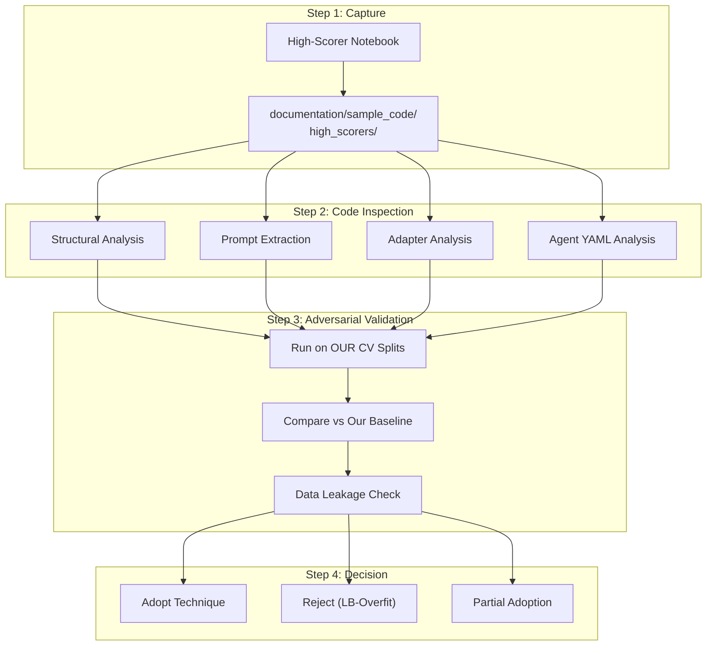

# Detailed Design 05 — Peer Solution Merging Protocol

---

## 1. Overview

The public Kaggle leaderboard provides a single Resolution Rate score computed against ~60 public test tasks. High-scoring public notebooks may be:

1. **Genuinely good** — robust strategies that generalise
2. **LB-overfit** — strategies tuned to the public test split that will fail on private
3. **Adversarially leaky** — solutions that exploit data leakage or test-set artifacts

This document defines a strict protocol to evaluate, stress-test, and selectively adopt techniques from public high-scoring solutions.

---

## 2. Peer Analysis Pipeline



---

## 3. Step 1: Capture & Cataloguing

### 3.1 High-Scorer Registry

```python
@dataclass
class PeerSolution:
    """Metadata for a captured peer solution."""
    notebook_name: str
    kaggle_url: str
    author: str
    lb_score: float
    capture_date: str
    local_path: Path
    analysis_status: str      # "pending" | "inspected" | "tested" | "adopted" | "rejected"
    
    # Extracted components
    prompt_strategy: str | None
    agent_architecture: str | None
    adapter_details: str | None
    key_techniques: list[str]
    
    # Adversarial results
    cv_score: float | None
    cv_lb_gap: float | None
    leak_detected: bool | None
```

### 3.2 Cataloguing Checklist

For each captured notebook, record:

| Field | Description |
|---|---|
| LB Score | Public leaderboard resolution rate |
| Submission date | When it was submitted |
| Uses adapter? | Does it include fine-tuned LoRA adapters? |
| Uses SFT? | Does it perform SFT training? |
| Uses RL? | Does it perform RL training? |
| Prompt strategy | Key elements of the system prompt |
| Agent architecture | Single agent or multi-agent? AgentTool delegation? |
| Data augmentation | How does it generate training trajectories? |
| Known dependencies | External libraries or data sources used |
| Red flags | Any suspicious patterns (hardcoded test IDs, etc.) |

---

## 4. Step 2: Code Inspection (`PeerAnalyser`)

### 4.1 Structural Analysis

```python
class PeerAnalyser:
    """Adversarial evaluation of peer solutions."""
    
    _LEAKAGE_KEYWORDS: list[str] = [
        "test_patch", "instance_id", "solution", "answer",
        "ground_truth", "gold_patch", "reference_patch",
    ]
    
    _OVERFITTING_INDICATORS: list[str] = [
        "specific task", "hardcoded", "manual fix",
        "if instance_id ==", "special case",
    ]
    
    def inspect(self, solution: PeerSolution) -> InspectionReport:
        """Perform thorough code inspection."""
        notebook = self._load_notebook(solution.local_path)
        
        checks = []
        
        # 1. Data leakage scan
        checks.append(self._scan_for_leakage(notebook))
        
        # 2. Overfitting pattern detection
        checks.append(self._scan_for_overfitting(notebook))
        
        # 3. Architecture extraction
        architecture = self._extract_architecture(notebook)
        
        # 4. Prompt extraction
        prompts = self._extract_prompts(notebook)
        
        # 5. Training strategy extraction
        training = self._extract_training_strategy(notebook)
        
        # 6. Novel technique identification
        techniques = self._identify_novel_techniques(notebook)
        
        return InspectionReport(
            solution=solution,
            checks=checks,
            architecture=architecture,
            prompts=prompts,
            training=training,
            novel_techniques=techniques,
            risk_level=self._assess_risk(checks),
        )
```

### 4.2 Data Leakage Detection

```python
def _scan_for_leakage(self, notebook: Notebook) -> InspectionCheck:
    """Detect potential data leakage in the solution."""
    findings: list[str] = []
    
    for cell in notebook.code_cells:
        code = cell.source
        
        # Check for leakage keywords
        for keyword in self._LEAKAGE_KEYWORDS:
            if keyword in code.lower():
                findings.append(
                    f"Leakage keyword '{keyword}' found in cell {cell.index}"
                )
        
        # Check if solution accesses test_patch or patch during inference
        if "test_patch" in code and ("agent" in code or "inference" in code):
            findings.append(
                "CRITICAL: test_patch accessed during inference pipeline"
            )
        
        # Check for hardcoded instance_ids
        import re
        instance_pattern = r'["\'](?:fastapi|rich|requests|httpx)_\d+["\']'
        matches = re.findall(instance_pattern, code)
        if len(matches) > 5:  # More than 5 hardcoded task IDs is suspicious
            findings.append(
                f"SUSPICIOUS: {len(matches)} hardcoded instance_ids found"
            )
        
        # Check for direct file path references to test files
        if "/test_" in code or "test_patch" in code:
            if "apply" in code or "patch" in code:
                findings.append(
                    "WARNING: Possible test patch application in agent logic"
                )
    
    return InspectionCheck(
        name="data_leakage",
        passed=len(findings) == 0,
        findings=findings,
        severity="critical" if any("CRITICAL" in f for f in findings) else "warning",
    )
```

### 4.3 Overfitting Pattern Detection

```python
def _scan_for_overfitting(self, notebook: Notebook) -> InspectionCheck:
    """Detect patterns indicative of public LB overfitting."""
    findings: list[str] = []
    
    for cell in notebook.code_cells:
        code = cell.source
        
        # Task-specific conditional logic
        for indicator in self._OVERFITTING_INDICATORS:
            if indicator in code.lower():
                findings.append(
                    f"Overfitting indicator '{indicator}' in cell {cell.index}"
                )
        
        # Manual patch dictionaries
        if "patch_map" in code or "manual_patches" in code:
            findings.append("CRITICAL: Manual patch dictionary detected")
        
        # Extremely low training epochs with high LB score
        if "num_epochs" in code or "num_train_epochs" in code:
            epoch_match = re.search(r'num_(?:train_)?epochs\s*[=:]\s*(\d+)', code)
            if epoch_match and int(epoch_match.group(1)) <= 1:
                findings.append(
                    "SUSPICIOUS: Only 1 training epoch — likely prompt-only submission"
                )
    
    return InspectionCheck(
        name="overfitting_patterns",
        passed=len([f for f in findings if "CRITICAL" in f]) == 0,
        findings=findings,
    )
```

---

## 5. Step 3: Adversarial Validation

### 5.1 Cross-Validation Stress Test

```python
def adversarial_cv_test(
    self, solution: PeerSolution, tasks: list[Task]
) -> AdversarialResult:
    """Run the peer solution's strategy through our CV framework."""
    
    # 1. Extract the adoptable components
    components = self._extract_components(solution)
    
    # 2. Create a modified version of our pipeline with peer components
    modified_config = self._merge_components(self._baseline_config, components)
    
    # 3. Run full CV evaluation
    cv_result = self._cv_evaluator.evaluate_all_folds(
        adapter_path=modified_config.adapter_path,
        tasks=tasks,
        version=f"peer_{solution.notebook_name}",
    )
    
    # 4. Compare with our baseline
    baseline_result = self._cv_evaluator.evaluate_all_folds(
        adapter_path=self._baseline_config.adapter_path,
        tasks=tasks,
        version="baseline",
    )
    
    # 5. Compute adversarial metrics
    improvement = cv_result.aggregate_resolution_rate - baseline_result.aggregate_resolution_rate
    cv_lb_gap = abs(cv_result.aggregate_resolution_rate - solution.lb_score)
    
    # 6. Statistical significance test
    is_significant = self._bootstrap_significance_test(
        cv_result.per_task_results,
        baseline_result.per_task_results,
        confidence=0.95,
    )
    
    return AdversarialResult(
        peer_cv_score=cv_result.aggregate_resolution_rate,
        baseline_cv_score=baseline_result.aggregate_resolution_rate,
        improvement=improvement,
        cv_lb_gap=cv_lb_gap,
        is_significant=is_significant,
        per_fold_comparison={
            fold.val_repo: {
                "peer": peer_r.resolution_rate,
                "baseline": base_r.resolution_rate,
                "delta": peer_r.resolution_rate - base_r.resolution_rate,
            }
            for fold, peer_r, base_r in zip(
                self._splitter.create_splits(tasks),
                cv_result.fold_results,
                baseline_result.fold_results,
            )
        },
    )
```

### 5.2 Bootstrap Significance Test

```python
def _bootstrap_significance_test(
    self,
    treatment_results: list[TaskResult],
    control_results: list[TaskResult],
    confidence: float = 0.95,
    n_bootstrap: int = 10000,
) -> bool:
    """Test if improvement is statistically significant via bootstrap."""
    treatment_resolved = [1 if r.resolved else 0 for r in treatment_results]
    control_resolved = [1 if r.resolved else 0 for r in control_results]
    
    observed_diff = np.mean(treatment_resolved) - np.mean(control_resolved)
    
    # Bootstrap under null hypothesis (pooled)
    pooled = treatment_resolved + control_resolved
    n_treatment = len(treatment_resolved)
    
    rng = np.random.RandomState(42)
    bootstrap_diffs = []
    
    for _ in range(n_bootstrap):
        permuted = rng.permutation(pooled)
        boot_treatment = permuted[:n_treatment]
        boot_control = permuted[n_treatment:]
        bootstrap_diffs.append(np.mean(boot_treatment) - np.mean(boot_control))
    
    p_value = np.mean(np.array(bootstrap_diffs) >= observed_diff)
    
    return p_value < (1 - confidence)
```

---

## 6. Step 4: Decision Framework

### 6.1 Adoption Criteria Matrix

| Metric | Adopt | Partial Adopt | Reject |
|---|---|---|---|
| **CV improvement** | > +5% AND significant | > +2% AND significant | ≤ +2% OR not significant |
| **CV-LB gap** | < 10% | 10-20% | > 20% |
| **Leakage scan** | Clean | Minor warnings | Critical findings |
| **Overfitting scan** | Clean | Minor patterns | Hardcoded patches |
| **Per-fold consistency** | Improves ≥3/4 folds | Improves ≥2/4 folds | Improves ≤1/4 folds |

### 6.2 Decision Logic

```python
def make_decision(self, report: InspectionReport, adversarial: AdversarialResult) -> Decision:
    """Apply decision matrix to determine adoption strategy."""
    
    # Hard rejections
    if report.risk_level == "critical":
        return Decision(
            action="REJECT",
            reason="Critical leakage or overfitting detected",
            confidence="high",
        )
    
    if adversarial.cv_lb_gap > 0.20:
        return Decision(
            action="REJECT",
            reason=f"CV-LB gap {adversarial.cv_lb_gap:.1%} exceeds 20% threshold — "
                   f"likely overfit to public test set",
            confidence="high",
        )
    
    # Adoption criteria
    if (
        adversarial.improvement > 0.05
        and adversarial.is_significant
        and adversarial.cv_lb_gap < 0.10
        and report.risk_level in ("clean", "low")
    ):
        # Check fold consistency
        improving_folds = sum(
            1 for v in adversarial.per_fold_comparison.values()
            if v["delta"] > 0
        )
        
        if improving_folds >= 3:
            return Decision(
                action="ADOPT",
                reason=f"CV improvement +{adversarial.improvement:.1%}, "
                       f"significant, consistent across {improving_folds}/4 folds",
                confidence="high",
                components_to_adopt=report.novel_techniques,
            )
    
    # Partial adoption
    if (
        adversarial.improvement > 0.02
        and adversarial.is_significant
        and report.risk_level != "critical"
    ):
        # Identify which specific techniques contribute positively
        beneficial = self._isolate_beneficial_techniques(
            report.novel_techniques, adversarial
        )
        
        if beneficial:
            return Decision(
                action="PARTIAL_ADOPT",
                reason=f"Selective adoption of {len(beneficial)} techniques",
                confidence="medium",
                components_to_adopt=beneficial,
            )
    
    return Decision(
        action="REJECT",
        reason=f"Insufficient improvement (+{adversarial.improvement:.1%}) "
               f"or inconsistent across folds",
        confidence="medium",
    )
```

---

## 7. Technique Isolation Testing

### 7.1 Ablation Study Protocol

When partially adopting, we isolate each technique:

```python
def _isolate_beneficial_techniques(
    self, techniques: list[str], adversarial: AdversarialResult
) -> list[str]:
    """Test each technique individually to identify truly beneficial ones."""
    beneficial = []
    
    for technique in techniques:
        # Apply only this single technique
        single_config = self._merge_single_technique(
            self._baseline_config, technique
        )
        
        # Run quick CV (subset of tasks for speed)
        quick_result = self._cv_evaluator.quick_evaluate(
            adapter_path=single_config.adapter_path,
            task_ids=self._quick_eval_task_ids,
            tasks=self._tasks,
        )
        
        baseline_quick = self._cv_evaluator.quick_evaluate(
            adapter_path=self._baseline_config.adapter_path,
            task_ids=self._quick_eval_task_ids,
            tasks=self._tasks,
        )
        
        delta = quick_result.resolution_rate - baseline_quick.resolution_rate
        
        if delta > 0.02:
            beneficial.append(technique)
            self._telemetry.log_info(
                f"Technique '{technique}' provides +{delta:.1%} improvement"
            )
        else:
            self._telemetry.log_info(
                f"Technique '{technique}' provides only {delta:+.1%} — skipping"
            )
    
    return beneficial
```

---

## 8. Peer Analysis Registry (`peer_registry.yaml`)

```yaml
# Peer Solution Registry
# Updated: 2026-09-29

solutions:
  - name: "gemma-eda-baseline-for-a-start-lb-top-1"
    author: "anonymous"
    lb_score: null  # To be filled after inspection
    capture_date: "2026-09-29"
    local_path: "documentation/sample_code/high_scorers/gemma-eda-baseline-for-a-start-lb-top-1.ipynb"
    status: "pending"
    risk_level: null
    cv_score: null
    decision: null
    notes: "First captured high-scorer. Requires full inspection."

# Template for new entries:
#  - name: "<notebook-name>"
#    author: "<author>"
#    lb_score: <float>
#    capture_date: "<YYYY-MM-DD>"
#    local_path: "documentation/sample_code/high_scorers/<filename>"
#    status: "pending"
#    risk_level: null
#    cv_score: null
#    decision: null
#    notes: ""
```
