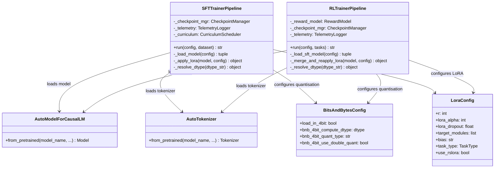

# Enhancement Design 01 — Remove Unsloth Dependency

---

## 1. Problem Statement

The project currently depends on `unsloth` for two core capabilities:

1. **Model loading** — `FastLanguageModel.from_pretrained()` loads the base model with 4-bit
   quantisation and memory optimisations.
2. **LoRA application** — `FastLanguageModel.get_peft_model()` attaches QLoRA adapters with
   Unsloth-specific gradient checkpointing.

`unsloth` is **not available** on the target Kaggle competition environment (no internet access,
module not pre-installed), producing:

```
ModuleNotFoundError: No module named 'unsloth'
```

### Affected Source Files

| File | Unsloth Usages |
|------|----------------|
| [`sft_trainer.py`](file:///home/somesh/git_repos/gemma4_dev_agent/src/training/sft_trainer.py) | `_load_model()` (L129), `_apply_lora()` (L70) |
| [`rl_trainer.py`](file:///home/somesh/git_repos/gemma4_dev_agent/src/training/rl_trainer.py) | `_load_sft_model()` (L100), `_merge_and_reapply_lora()` (L117) |

### Affected Test Files

| File | Mock Targets |
|------|--------------|
| [`test_sft_trainer.py`](file:///home/somesh/git_repos/gemma4_dev_agent/tests/unit/training/test_sft_trainer.py) | `unsloth` module mock (L29), `FastLanguageModel` mocks |
| [`test_rl_trainer.py`](file:///home/somesh/git_repos/gemma4_dev_agent/tests/unit/training/test_rl_trainer.py) | `unsloth` module mock (L159–173) |

### Affected Config Files

| File | Reference |
|------|-----------|
| [`pyproject.toml`](file:///home/somesh/git_repos/gemma4_dev_agent/pyproject.toml) | `unsloth` in `[project.optional-dependencies.training]` (L25), mypy overrides (L55) |

---

## 2. Solution: Replace Unsloth with HuggingFace transformers + peft

All functionality provided by Unsloth can be replicated with the standard HuggingFace stack, which
**is** available on Kaggle (pre-installed or bundled offline):

| Unsloth API | Replacement | Library |
|-------------|-------------|---------|
| `FastLanguageModel.from_pretrained()` | `AutoModelForCausalLM.from_pretrained()` with `BitsAndBytesConfig` | `transformers` + `bitsandbytes` |
| `FastLanguageModel.get_peft_model()` | `get_peft_model()` with `LoraConfig` | `peft` |
| `use_gradient_checkpointing="unsloth"` | `model.gradient_checkpointing_enable({"use_reentrant": False})` | `transformers` |

### 2.1 Why This Works

- The Gemma 4 31B QAT model (`google/gemma-4-31b-it-qat-w4a16-ct`) is a standard HuggingFace model
  and loads natively via `AutoModelForCausalLM`.
- The `W4A16` quantisation is already baked into the model weights — we pass
  `BitsAndBytesConfig(load_in_4bit=True)` to load them in 4-bit mode without Unsloth's wrapper.
- PEFT's `get_peft_model()` + `LoraConfig` provides identical QLoRA adapter functionality.
- Gradient checkpointing is a native PyTorch / transformers feature.

### 2.2 Trade-offs

| Aspect | Unsloth | HuggingFace Native |
|--------|---------|--------------------|
| Memory footprint | ~10-15% lower (kernel fusion) | Standard — mitigated by gradient checkpointing |
| Training speed | ~1.5-2x faster (fused kernels) | Standard — acceptable for competition timeline |
| Compatibility | Fragile — version pinning issues | Robust — first-party support |
| Availability | **NOT on Kaggle offline** | **Pre-installed on Kaggle** |

> The slight performance regression is acceptable because **the code must actually run** on Kaggle.

---

## 3. Detailed Replacement Design

### 3.1 Model Loading — New `_load_model()` Implementation

**Before (Unsloth):**
```python
from unsloth import FastLanguageModel

model, tokenizer = FastLanguageModel.from_pretrained(
    model_name=config.name,
    max_seq_length=config.max_seq_length,
    dtype=config.dtype,
    load_in_4bit=config.load_in_4bit,
    device_map="auto",
    trust_remote_code=True,
)
```

**After (HuggingFace):**
```python
from transformers import AutoModelForCausalLM, AutoTokenizer, BitsAndBytesConfig

quantization_config = BitsAndBytesConfig(
    load_in_4bit=config.load_in_4bit,
    bnb_4bit_compute_dtype=self._resolve_dtype(config.dtype),
    bnb_4bit_quant_type="nf4",
    bnb_4bit_use_double_quant=True,
)

model = AutoModelForCausalLM.from_pretrained(
    config.name,
    quantization_config=quantization_config,
    device_map="auto",
    trust_remote_code=True,
    torch_dtype=self._resolve_dtype(config.dtype),
)

tokenizer = AutoTokenizer.from_pretrained(
    config.name,
    trust_remote_code=True,
)
```

**Key Design Decisions:**
- `bnb_4bit_quant_type="nf4"` — NormalFloat4 is the standard for QLoRA.
- `bnb_4bit_use_double_quant=True` — Additional memory savings via double quantisation.
- `bnb_4bit_compute_dtype` — Matches the original `dtype` param (bfloat16).
- Model and tokenizer are loaded separately (Unsloth bundled them; HuggingFace does not).

### 3.2 LoRA Application — New `_apply_lora()` Implementation

**Before (Unsloth):**
```python
from unsloth import FastLanguageModel

lora_model = FastLanguageModel.get_peft_model(
    model,
    r=config.r,
    lora_alpha=config.lora_alpha,
    lora_dropout=config.lora_dropout,
    target_modules=config.target_modules,
    bias=config.bias,
    use_gradient_checkpointing="unsloth",
    random_state=42,
    use_rslora=True,
    loftq_config=None,
)
```

**After (HuggingFace peft):**
```python
from peft import LoraConfig, TaskType, get_peft_model

lora_config = LoraConfig(
    r=config.r,
    lora_alpha=config.lora_alpha,
    lora_dropout=config.lora_dropout,
    target_modules=config.target_modules,
    bias=config.bias,
    task_type=TaskType.CAUSAL_LM,
    use_rslora=True,
)

model.enable_input_require_grads()
lora_model = get_peft_model(model, lora_config)
lora_model.gradient_checkpointing_enable(
    gradient_checkpointing_kwargs={"use_reentrant": False}
)
```

**Key Design Decisions:**
- `enable_input_require_grads()` — Required for LoRA training with quantised models.
- `gradient_checkpointing_enable()` with `use_reentrant=False` — Replaces Unsloth's custom
  gradient checkpointing. Non-reentrant is safer and recommended by PyTorch.
- `TaskType.CAUSAL_LM` — Matches the original `task_type` from LoRAConfig.
- `use_rslora=True` — Rank-stabilised LoRA is supported natively by peft.

### 3.3 Dtype Resolution Helper

A new private method `_resolve_dtype()` is needed to convert string dtype names to torch dtypes:

```python
def _resolve_dtype(self, dtype_str: str) -> object:
    """Convert string dtype identifier to torch dtype."""
    import torch
    dtype_map = {
        "bfloat16": torch.bfloat16,
        "float16": torch.float16,
        "float32": torch.float32,
    }
    return dtype_map.get(dtype_str, torch.bfloat16)
```

---

## 4. Impact on RLTrainerPipeline

The `rl_trainer.py` file uses the same two Unsloth APIs in different methods:

### 4.1 `_load_sft_model()` — Model Loading

Identical replacement as § 3.1 above. After loading, the SFT adapter is merged using `peft`
(`PeftModel.from_pretrained()` → `merge_and_unload()`), which is **already using peft** and
remains unchanged.

### 4.2 `_merge_and_reapply_lora()` — Fresh LoRA for RL

Identical replacement as § 3.2 above. The fresh LoRA adapter for RL training is applied using
`get_peft_model()` + `LoraConfig` instead of `FastLanguageModel.get_peft_model()`.

---

## 5. Class Diagram — Updated Model Loading Stack



---

## 6. Configuration Changes

### 6.1 `pyproject.toml` Updates

```diff
 [project.optional-dependencies]
 training = [
     "torch>=2.0",
     "transformers>=4.40",
     "peft>=0.12",
     "trl>=0.9",
-    "unsloth",
+    "bitsandbytes>=0.43",
     "safetensors",
 ]
```

```diff
 [[tool.mypy.overrides]]
 module = [
-    "unsloth.*",
     "trl.*",
     "peft.*",
     "transformers.*",
     "datasets.*",
     "networkx.*",
     "sklearn.*",
     "safetensors.*",
     "torch.*",
     "yaml.*",
+    "bitsandbytes.*",
 ]
```

---

## 7. Test Impact

Tests currently mock `unsloth.FastLanguageModel`. After migration, they must mock:

| Old Mock Target | New Mock Target |
|-----------------|-----------------|
| `unsloth.FastLanguageModel.from_pretrained` | `transformers.AutoModelForCausalLM.from_pretrained` + `transformers.AutoTokenizer.from_pretrained` |
| `unsloth.FastLanguageModel.get_peft_model` | `peft.get_peft_model` |
| `sys.modules["unsloth"]` | `sys.modules["transformers"]` + `sys.modules["peft"]` (already partially mocked) |

The mock structure becomes simpler because `transformers` and `peft` are already mocked in several
tests. The `unsloth` mock entries are removed entirely.

---

## 8. Migration Checklist

- [ ] Update `sft_trainer.py` — replace `_load_model()` and `_apply_lora()`
- [ ] Update `rl_trainer.py` — replace `_load_sft_model()` and `_merge_and_reapply_lora()`
- [ ] Update `pyproject.toml` — remove `unsloth`, add `bitsandbytes`
- [ ] Update `test_sft_trainer.py` — replace `unsloth` mocks
- [ ] Update `test_rl_trainer.py` — replace `unsloth` mocks
- [ ] Run full CI: `ruff check` → `mypy` → `pytest`
- [ ] Verify method length limits (≤ 20 lines) after changes
- [ ] Verify file length limits (≤ 500 lines) after changes
