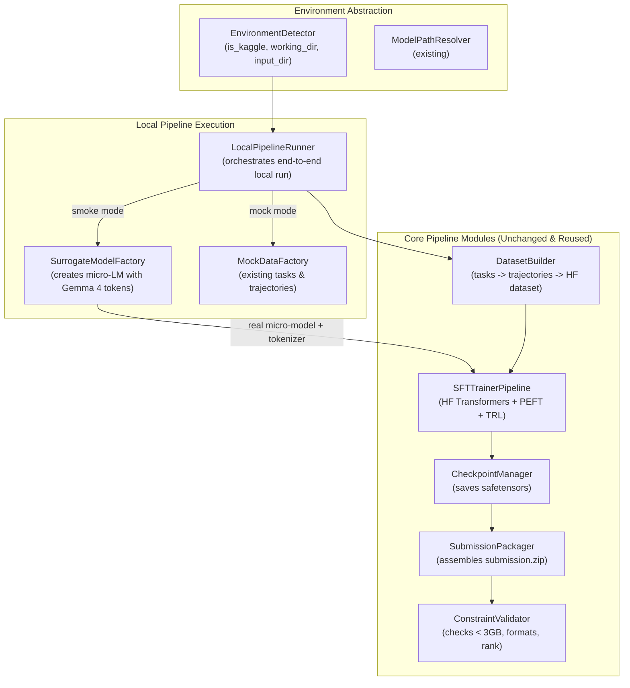

# Enhancement Design 06 — Local Kaggle Execution Environment

---

## 1. Problem Statement & Motivation

During post-training pipeline development for the Kaggle Gemma 4 Developer Agent competition, recurring runtime defects were only uncovered after pushing datasets and running remote Kaggle GPU notebooks:

1. **Unsloth Missing Module** (`ModuleNotFoundError: No module named 'unsloth'`) — Kaggle offline runtime environment lacked Unsloth.
2. **Offline DNS / Model Resolution** (`[Errno -3] Temporary failure in name resolution`) — Remote Hugging Face Hub downloads failed due to disabled internet.
3. **Quantization Config Collisions** (`ValueError: CompressedTensorsConfig vs BitsAndBytesConfig`) — Passing explicit 4-bit quant config to pre-quantized QAT weights caused fatal mismatch.
4. **Special Tokens Mismatch** (`ValueError: Missing required special token: <start_of_turn>`) — Tokenizer verification failed on Gemma 4 turn/channel token changes.
5. **PEFT Target Module Rejection** (`ValueError: Target module Gemma4ClippableLinear is not supported`) — PEFT rejected Gemma 4's custom clipping projection wrapper.
6. **TRL SFTConfig Keyword Deprecation** (`TypeError: SFTConfig.__init__() got unexpected keyword argument 'max_length' / 'max_seq_length'`) — Library version discrepancies in parameter naming.

### 1.1 The Root Cause of Slow Feedback Cycles

The feedback loop is currently constrained by:
- Packaging code into `kaggle_staging/`
- Pushing via `kaggle datasets version -p kaggle_staging/`
- Waiting for Kaggle dataset ingestion
- Starting a Kaggle GPU notebook, waiting in the cluster queue
- Discovering a runtime crash only after several minutes of remote setup
- Diagnosing errors from remote logs and repeating the cycle

### 1.2 The Local Environment Reality

The developer has recreated the Kaggle environment locally inside Python virtual environment `~/python_envs/p312_kaggle` with identical core packages:
- Python 3.12.14
- PyTorch 2.10.0
- Hugging Face Transformers 5.18.0
- TRL 0.29.1
- PEFT 0.18+
- vLLM 0.19.1

However, attempting to run the training pipeline locally today fails immediately:
1. **Hardcoded Kaggle Filesystem Paths**: Configuration files (`configs/sft_config.yaml`) and notebooks (`train_notebook.ipynb`) hardcode `/kaggle/input/...` and `/kaggle/working/...`. On a local Linux workstation, `/kaggle` does not exist, causing fatal `FileNotFoundError` or permission errors.
2. **Hardware Constraints**: Kaggle provides 4x NVIDIA L4 GPUs (96 GB VRAM). The local development machine possesses an NVIDIA RTX 3050 Laptop GPU (6 GB VRAM) or CPU. Attempting to load the full 31B parameter model (`gemma-4-31b-it-qat-w4a16-ct`) locally results in immediate Out-Of-Memory (OOM) or missing weight directory errors.
3. **Mock Pipeline Divergence**: The existing `MockNotebook` (`notebooks/mock_notebook.py`) mocks out the training phase entirely by generating a dummy 1 KB file, bypassing `transformers`, `peft`, and `trl` code paths. Consequently, `MockNotebook` passed cleanly despite all 6 critical library and API bugs that broke Kaggle execution.

---

## 2. High-Level Design Adherence

This enhancement directly operationalizes principles from the high-level design:
- **`01_system_overview.md` §2 & §3**: Maintains the boundary between local development, staging, and remote execution. Adds a robust local validation capability that exercises actual library integrations.
- **`02_architecture_diagram.md` §1**: Integrates local pipeline execution without altering the Kaggle runtime contract.
- **`04_training_strategy.md` §2**: Verifies that SFT training mechanics (LoRA target module resolution, token verification, curriculum filtering, and TRL trainer configuration) execute faithfully.
- **`07_deployment_strategy.md` §1 & §2**: Verifies that `SubmissionPackager` and `ConstraintValidator` successfully assemble `submission.zip` matching competition rules.
- **`documentation/prompts/coding_standards.md`**: Strict compliance with SOLID, DRY, YAGNI, Strict OOP (classes only, single class per file), method length ≤ 20 lines, file length ≤ 500 lines, no magic strings/numbers, and 90%+ test coverage.

---

## 3. Architecture & System Design

### 3.1 Component Architecture

#### 1. `EnvironmentDetector` (`src/utils/environment_detector.py`)
Provides deterministic detection of whether execution is occurring within the Kaggle environment or a local workstation, resolving directory paths dynamically:
- Kaggle Indicators: Presence of `/kaggle/working` directory or `KAGGLE_KERNEL_RUN_TYPE` environment variable.
- Working Directory: `/kaggle/working` when on Kaggle; `./kaggle_working` (or `SWEGEMMA_WORKING_DIR`) when local.
- Input Directory: `/kaggle/input` when on Kaggle; `./data` or `./kaggle_staging` when local.
- Submission Zip Path: `${working_dir}/submission.zip`.
- Checkpoints Path: `${working_dir}/checkpoints`.
- Logs Path: `${working_dir}/logs`.

#### 2. `SurrogateModelFactory` (`src/training/surrogate_model_factory.py`)
To validate the full training pipeline locally without OOM on a 6 GB GPU:
- Dynamically constructs a tiny causal language model architecture (e.g. 2 layers, hidden size 64, intermediate size 128, 2 attention heads) using standard Hugging Face classes (`LlamaConfig` / `LlamaForCausalLM` or `AutoModelForCausalLM`).
- Configures target linear modules named identically to Gemma 4 projection layers (`q_proj`, `k_proj`, `v_proj`, `o_proj`, `gate_proj`, `up_proj`, `down_proj`).
- Generates a lightweight tokenizer vocabulary that includes all 14 Gemma 4 mandatory special tokens (`<|turn>`, `<turn|>`, `<|tool_call>`, `<tool_call|>`, `<|channel>`, `<channel|>`, etc.).
- Persists or holds the surrogate model in memory or a temporary directory so `AutoConfig.from_pretrained`, `AutoTokenizer.from_pretrained`, `AutoModelForCausalLM.from_pretrained`, `LoRATargetModuleResolver`, `get_peft_model`, and `TRLSFTTrainer` are exercised with **zero mocks**.

#### 3. `LocalPipelineRunner` (`src/training/local_pipeline_runner.py`)
A unified orchestrator for executing the complete pipeline locally:
- Execution Modes:
  - `smoke`: Runs real dataset building, loads the surrogate model, attaches LoRA adapters via `LoRATargetModuleResolver`, initializes `TRLSFTTrainer` (with `SFTConfig`), performs 1 training step, writes `.safetensors` adapters, packages `submission.zip`, and validates constraints. Executes in < 15 seconds.
  - `mock`: Runs fast structural wiring test without ML models (compatible with CI).
  - `full`: Runs on local GPU with full local model path and dataset if configured via environment variables.
- Structured Reporting: Emits execution logs, step durations, and packaging validation reports.

#### 4. `train_notebook.ipynb` Harmonization
Refactors the top cells of `notebooks/train_notebook.ipynb` to use `EnvironmentDetector`:
- Automatically detects Kaggle vs local execution.
- If running on Kaggle, resolves to standard `/kaggle/input/...` dataset paths.
- If running locally, falls back to repository paths (`./configs/sft_config.yaml`, `./kaggle_working/logs`, `./kaggle_staging/submission_templates`).
- Enables running the entire notebook locally in VS Code or Jupyter with kernel set to `~/python_envs/p312_kaggle`.

---

## 4. Key Design Invariants & Guardrails

1. **Zero Mocking of External Training Stack in Smoke Mode**:
   Unlike unit tests which mock `transformers`, `peft`, and `trl`, the local smoke runner MUST call real library classes. Any parameter name changes (like `max_length` vs `max_seq_length`), import errors, or PEFT target module errors are caught immediately.
2. **Resource Isolation**:
   Local temporary directories and working artifacts are created strictly inside `./kaggle_working` or designated temp directories, never cluttering the repository root or leaking into git.
3. **Competition Submission Integrity**:
   Packaging and validation must use the exact same `SubmissionPackager` and `ConstraintValidator` logic on local runs as on remote Kaggle runs, ensuring byte-level confidence before push.
4. **Adherence to Coding Standards**:
   - Single class per file.
   - Method length ≤ 20 lines.
   - File length ≤ 500 lines.
   - No magic strings/numbers.
   - Type annotations on all methods.
