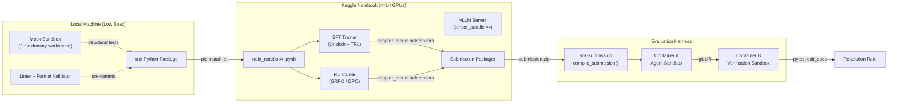

# 01 — System Overview

> **Project Codename:** SweGemma-Agent  
> **Competition:** [Gemma 4 Developer Agent](https://www.kaggle.com/competitions/gemma-4-developer-agent)  
> **Objective:** Post-train `gemma-4-31b-it-qat-w4a16-ct` via SFT → RL to maximise Resolution Rate on hidden SWE-bench–style tasks.

---

## 1. Mission Statement

Build an autonomous software-engineering agent that, given a natural-language bug report and a frozen repository snapshot, can:

1. **Navigate** large Python codebases using file I/O + AST graph tools.
2. **Diagnose** the root cause by correlating the problem statement with code topology.
3. **Patch** the production code (never the tests) with minimal, correct diffs.
4. **Self-verify** by executing targeted test commands inside the sandbox.
5. **Submit** a clean unified diff via `submit_patch()`.

The agent is deployed as a **declarative YAML tree** (`agent.yaml`) compiled by `adk-submission` — no arbitrary Python execution on the host.

---

## 2. Competitive Thesis

| Lever | Strategy |
|---|---|
| **Model Quality** | Two-stage post-training: SFT on curated gold trajectories → GRPO/DPO on rollout reward signals |
| **Tool Mastery** | Train the model to emit syntactically perfect `<\|tool_call\|>` blocks; zero truncation errors |
| **Context Efficiency** | Teach aggressive context compaction: summarise read_file outputs, avoid re-reading, use graph tools before brute-force grep |
| **Agent Architecture** | Multi-agent delegation via `AgentTool` (code analyser sub-agent isolates file-reading token cost from the main coder agent) |
| **Adapter Routing** | Specialised LoRA adapters: `coder_lora` (patch authoring), `navigator_lora` (code search & analysis) |
| **Robustness** | Strict local CV with Group K-Fold; adversarial stress-testing of peer solutions before adoption |

---

## 3. System Boundary Diagram

---

## 4. Component Inventory

| Component | Location | Responsibility |
|---|---|---|
| **Data Ingestor** | `src/data/ingestor.py` | Parse `tasks.jsonl`, load graph JSON, load embeddings `.npz` |
| **Trajectory Synthesiser** | `src/data/trajectory_synthesiser.py` | Convert `(problem, patch, test_patch)` → multi-turn chat trajectories with tool calls |
| **Chat Formatter** | `src/data/chat_formatter.py` | Apply Gemma 4 chat template tokens (`<start_of_turn>`, `<|tool_call|>`, etc.) |
| **SFT Trainer** | `src/training/sft_trainer.py` | QLoRA SFT via Unsloth + TRL `SFTTrainer` |
| **RL Trainer** | `src/training/rl_trainer.py` | GRPO/DPO via TRL with custom reward model |
| **Reward Model** | `src/training/reward_model.py` | Binary pass/fail reward from local pytest execution |
| **CV Evaluator** | `src/evaluation/cv_evaluator.py` | Group K-Fold cross-validation with Phase 1 + Phase 2 simulation |
| **Mock Sandbox** | `src/evaluation/mock_sandbox.py` | Lightweight 2-file workspace for local structural tests |
| **Submission Packager** | `src/deployment/submission_packager.py` | Assemble `kaggle_staging/`, validate constraints, zip |
| **Version Manager** | `src/deployment/version_manager.py` | Auto-increment versions, push via Kaggle CLI |
| **Telemetry Logger** | `src/utils/telemetry_logger.py` | Structured logging of training metrics to `./logs/` |
| **Config Manager** | `src/config/config_manager.py` | Central YAML-based configuration with env-var overrides |
| **Peer Analyser** | `src/evaluation/peer_analyser.py` | Adversarial evaluation of high-scorer notebooks |

---

## 5. Key Constraints Summary

| Constraint | Value | Enforced By |
|---|---|---|
| Base model | `gemma-4-31b-it-qat-w4a16-ct` | `validate_single_declared_model()` |
| Max submission size | < 3 GiB (3,221,225,472 bytes) | `build_submission_limits()` |
| Adapter format | `.safetensors` only | `allowed_file_extensions` |
| Max adapters | 8 | `max_loras=8` in vLLM config |
| Max adapter rank | 128 | `max_lora_rank=128` |
| Context window | 32,768 tokens | `max_model_len=32768` |
| Per-task time | 60 min default | `EvaluationBudget.time_minutes` |
| Tool calls per task | 100 default | `EvaluationBudget.tool_calls` |
| Command timeout | 300s | `HarnessLimits.command_timeout_seconds` |
| Total eval time | 12 hours all tasks | Competition rule |
| Training repos | `fastapi`, `rich`, `requests`, `httpx` | `tasks.jsonl` |
| Test set repos | Private repositories | Competition rule |

---

## 6. Success Criteria

| Metric | Target | Measurement |
|---|---|---|
| **Local CV Resolution Rate** | ≥ 0.45 | `cv_evaluator.py` Group K-Fold |
| **Public LB Resolution Rate** | ≥ 0.40 | Kaggle submission |
| **Tool-Call Syntax Error Rate** | < 1% | Trajectory analysis |
| **Token Truncation Rate** | < 2% | Nudge message frequency |
| **Adapter Size (total)** | < 1.5 GiB | `submission_packager.py` pre-flight |
| **Per-Task Avg Latency** | < 8 min | Telemetry logs |
