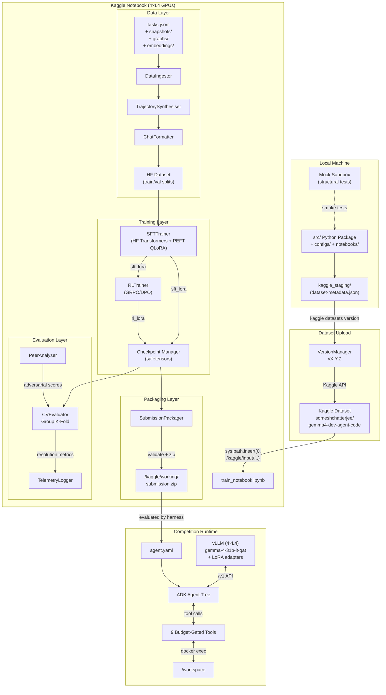

# 02 — Architecture Diagram & Directory Tree

---

## 1. End-to-End Architecture



---

## 2. Complete Directory Tree

```
gemma4_dev_agent/
│
├── README.md
├── notes.md                              # Kaggle CLI reference commands
├── .gitignore
│
├── src/                                  # Main Python package (pip install -e .)
│   ├── __init__.py
│   ├── config/
│   │   ├── __init__.py
│   │   ├── config_manager.py             # Central YAML config loader with env overrides
│   │   ├── schema.py                     # Pydantic config schemas
│   │   └── defaults.yaml                 # Default hyperparams & paths
│   │
│   ├── data/
│   │   ├── __init__.py
│   │   ├── ingestor.py                   # Parse tasks.jsonl, load graphs & embeddings
│   │   ├── trajectory_synthesiser.py     # Gold patch → multi-turn tool-call trajectories
│   │   ├── chat_formatter.py             # Apply Gemma 4 chat template tokens
│   │   ├── dataset_builder.py            # Build HF Dataset with train/val splits
│   │   ├── trajectory_augmentor.py       # Trajectory diversity: tool ordering, error recovery
│   │   ├── mock_data_factory.py          # Generate tiny 2-file dummy workspaces
│   │   └── constants.py                  # Shared data-layer constants
│   │
│   ├── training/
│   │   ├── __init__.py
│   │   ├── sft_trainer.py                # QLoRA SFT via HF Transformers + PEFT + TRL SFTTrainer
│   │   ├── rl_trainer.py                 # GRPO/DPO via TRL with reward signals
│   │   ├── reward_model.py               # Binary pass/fail reward from pytest
│   │   ├── training_config.py            # Training hyperparameter schemas
│   │   ├── callback_handler.py           # Custom TRL callbacks for telemetry
│   │   ├── checkpoint_manager.py         # Save/load safetensors, size validation
│   │   └── constants.py                  # Training-layer constants
│   │
│   ├── evaluation/
│   │   ├── __init__.py
│   │   ├── cv_evaluator.py               # Group K-Fold cross-validation engine
│   │   ├── cv_splitter.py                # Deterministic group split strategies
│   │   ├── trajectory_executor.py        # Simulate Phase 1 agent execution
│   │   ├── verification_runner.py        # Simulate Phase 2 pytest verification
│   │   ├── mock_sandbox.py               # Lightweight local mock sandbox
│   │   ├── peer_analyser.py              # Adversarial evaluation of high-scorer notebooks
│   │   ├── metric_tracker.py             # Track local CV vs public LB scores
│   │   └── constants.py                  # Evaluation-layer constants
│   │
│   ├── deployment/
│   │   ├── __init__.py
│   │   ├── submission_packager.py        # Assemble kaggle_staging/, validate, zip
│   │   ├── constraint_validator.py       # Pre-flight: size, format, schema checks
│   │   ├── version_manager.py            # Semantic versioning + Kaggle CLI push
│   │   ├── prompt_compiler.py            # Template system/instruction .md files
│   │   └── constants.py                  # Deployment-layer constants
│   │
│   └── utils/
│       ├── __init__.py
│       ├── telemetry_logger.py           # Structured JSON logging → ./logs/
│       ├── git_utils.py                  # Git diff parsing, patch application
│       ├── token_counter.py              # Token counting for context budget analysis
│       └── constants.py                  # Shared utility constants
│
├── tests/                                # pytest test suite (mirrors src/ structure)
│   ├── __init__.py
│   ├── conftest.py                       # Shared fixtures
│   ├── unit/
│   │   ├── data/
│   │   │   ├── test_ingestor.py
│   │   │   ├── test_trajectory_synthesiser.py
│   │   │   ├── test_chat_formatter.py
│   │   │   └── test_mock_data_factory.py
│   │   ├── training/
│   │   │   ├── test_sft_trainer.py
│   │   │   ├── test_checkpoint_manager.py
│   │   │   └── test_reward_model.py
│   │   ├── evaluation/
│   │   │   ├── test_cv_evaluator.py
│   │   │   ├── test_cv_splitter.py
│   │   │   └── test_mock_sandbox.py
│   │   └── deployment/
│   │       ├── test_submission_packager.py
│   │       └── test_constraint_validator.py
│   └── integration/
│       ├── test_data_pipeline.py
│       ├── test_mock_training.py
│       └── test_packaging_roundtrip.py
│
├── notebooks/
│   ├── train_notebook.ipynb              # Kaggle execution notebook (imports from src/)
│   └── exploration.ipynb                 # EDA / trajectory inspection
│
├── kaggle_staging/                       # Source code dataset — uploaded to Kaggle via API
│   ├── dataset-metadata.json             # Kaggle dataset metadata (id, title, licenses)
│   ├── src/                              # Symlink or copy of src/ for dataset upload
│   ├── configs/                          # Training & eval config YAMLs
│   ├── notebooks/                        # Kaggle execution notebooks
│   ├── submission_templates/             # Agent YAML + prompt templates (bundled into submission.zip on Kaggle)
│   │   ├── agent.yaml                    # Root compiled agent tree schema
│   │   ├── eval_config.yaml              # Per-task execution budget overrides
│   │   ├── prompts/
│   │   │   ├── system.md                 # System instruction for root coder agent
│   │   │   ├── navigator.md              # Instruction for code navigator sub-agent
│   │   │   └── patch_guidelines.md       # Patch formatting best practices
│   │   ├── sub_agents/
│   │   │   └── code_analyzer.yaml        # Read-only analysis AgentTool
│   │   └── skills/
│   │       └── repo_navigation/
│   │           └── SKILL.md
│   └── VERSION                           # Semantic version file for dataset tagging
│
├── documentation/
│   ├── competition_details/              # Raw Kaggle competition pages
│   │   ├── description.md
│   │   ├── evaluation.md
│   │   ├── model_rules.md
│   │   └── data-description.md
│   ├── prompts/                          # AI agent prompt templates
│   │   ├── 001_high_level_design_approach.md
│   │   └── coding_standards.md
│   ├── sample_code/
│   │   ├── getting-started-gemma-4-developer-agent.ipynb
│   │   └── high_scorers/
│   │       └── gemma-eda-baseline-for-a-start-lb-top-1.ipynb
│   └── design/                           # THIS DESIGN DOCUMENTATION
│       ├── high_level/
│       │   ├── 01_system_overview.md
│       │   ├── 02_architecture_diagram.md
│       │   ├── 03_data_flow_pipeline.md
│       │   ├── 04_training_strategy.md
│       │   ├── 05_evaluation_framework.md
│       │   ├── 06_agent_architecture.md
│       │   ├── 07_deployment_strategy.md
│       │   └── 08_risk_mitigation.md
│       └── detailed/
│           ├── 01_data_preprocessing.md
│           ├── 02_sft_training.md
│           ├── 03_rl_training.md
│           ├── 04_cv_evaluator.md
│           └── 05_peer_solution_protocol.md
│
├── data/                                 # Competition data (not in git for large files)
│   ├── HARNESS_README.md
│   ├── files.csv
│   ├── tasks.jsonl                       # (downloaded from Kaggle)
│   ├── snapshots/                        # (downloaded from Kaggle)
│   ├── graphs/                           # (downloaded from Kaggle)
│   └── embeddings/                       # (downloaded from Kaggle)
│
├── logs/                                 # Training & evaluation telemetry
│   └── run_v0.1.0.log
│
├── configs/                              # Pipeline configuration files
│   ├── sft_config.yaml
│   ├── rl_config.yaml
│   ├── eval_config.yaml
│   └── mock_config.yaml
│
├── pyproject.toml                        # Package definition, deps, tool configs
└── setup.py                              # Editable install support
```

---

## 3. Layer Responsibilities

### 3.1 Data Layer (`src/data/`)
- **Input**: Raw `tasks.jsonl` + repository snapshots + code graphs + embeddings
- **Output**: HuggingFace `Dataset` objects with train/validation splits
- **Key Contract**: Every output example is a complete multi-turn chat conversation formatted in the Gemma 4 chat template with tool-call annotations

### 3.2 Training Layer (`src/training/`)
- **Input**: HF Dataset from data layer
- **Output**: PEFT LoRA adapter checkpoints in `.safetensors` format
- **Key Contract**: Adapters must be saved with `adapter_config.json` compatible with vLLM's `enable_lora=True` + PEFT auto-loading

### 3.3 Evaluation Layer (`src/evaluation/`)
- **Input**: Trained adapter checkpoints + task subsets
- **Output**: Resolution Rate metrics, trajectory analysis reports
- **Key Contract**: Local CV score must correlate with public LB within ±0.10 tolerance

### 3.4 Deployment Layer (`src/deployment/`)
- **Input**: Source code package (`src/`), configs, submission templates, trained adapter checkpoints
- **Output (Local)**: Validated `kaggle_staging/` directory pushed as a Kaggle dataset via `kaggle datasets version`
- **Output (On Kaggle)**: `submission.zip` < 3 GiB assembled by the notebook at `/kaggle/working/` using trained adapters + templates
- **Key Contract**: Pre-flight validation catches every constraint violation before Kaggle push; the notebook is the final assembly point for `submission.zip`

### 3.5 Data Flow: Local → Kaggle → Evaluation
1. **Local**: `src/` + `configs/` + `submission_templates/` staged into `kaggle_staging/` → uploaded as Kaggle dataset
2. **Kaggle Notebook**: Imports dataset → registers `src/` on `sys.path` → runs training → saves adapters → copies templates + adapters into `/kaggle/working/submission/` → zips as `submission.zip`
3. **Evaluation Harness**: Loads `submission.zip` → compiles `agent.yaml` → runs inference → produces `submission.parquet`

### 3.6 Runtime (Competition Evaluation)
- **Input**: `submission.zip` produced by the Kaggle notebook
- **Output**: `submission.parquet` with `[id, prediction]` columns
- **Key Contract**: All agent behaviour is determined by `agent.yaml` + adapters; no Python code execution on host
