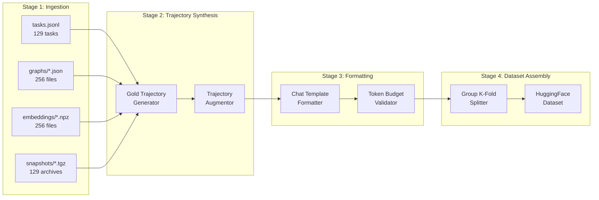

# 03 — Data Flow Pipeline

---

## 1. Pipeline Overview



---

## 2. Stage 1: Data Ingestion (`DataIngestor`)

### 2.1 Task Loading
```python
# Pseudocode: DataIngestor.load_tasks()
tasks: list[Task] = []
for line in open("tasks.jsonl"):
    task = json.loads(line)
    # Fields: instance_id, repo, base_commit, problem_statement,
    #         hints_text, patch, test_patch, created_at
    tasks.append(Task(**task))
# Result: 129 Task objects from 4 repos (fastapi, rich, requests, httpx)
```

### 2.2 Graph Loading
- Parse `graphs/<instance_id>.json` → NetworkX `MultiDiGraph`
- Extract: nodes (id, name, text), edges (source, target, type, key)
- Build symbol-to-source-code lookup table

### 2.3 Embedding Loading
- Load `embeddings/<instance_id>.npz` → dict of `{node_id: np.ndarray(256,)}`
- Pre-compute node similarity matrix for trajectory synthesis

### 2.4 Repository Metadata Extraction
- Classify repos: `fastapi` (web framework), `rich` (terminal rendering), `requests` (HTTP client), `httpx` (async HTTP)
- Compute per-task metadata: lines changed in `patch`, number of files touched, test count in `test_patch`
- Assign complexity tiers: `SIMPLE` (1 file, <20 lines), `MODERATE` (1-3 files, 20-100 lines), `COMPLEX` (>3 files or >100 lines)

---

## 3. Stage 2: Trajectory Synthesis (`TrajectorySynthesiser`)

This is the **most critical** component. We convert static `(problem_statement, patch)` pairs into realistic multi-turn agent trajectories with tool calls.

### 3.1 Gold Trajectory Generation Algorithm

For each task, we reverse-engineer a plausible agent trajectory that would produce the gold `patch`:

```
INPUT:  task.problem_statement, task.patch, task.hints_text, graph, embeddings
OUTPUT: List[Turn] where Turn = (role, content, tool_calls?, tool_results?)

ALGORITHM:
1. PARSE the gold patch into a list of FileChange(filepath, hunks[])
2. For each FileChange:
   a. PLAN phase (model thinking):
      - Generate a reasoning block that analyses the problem statement
      - Reference relevant symbols from the code graph
   b. NAVIGATE phase (tool calls):
      - search_similar_code(query=<relevant_symbol>) → find related code
      - get_code_neighbors(node=<target_function>) → understand call graph
      - read_file(filepath, start_line, end_line) → examine context around the change
   c. DIAGNOSE phase (model thinking):
      - Articulate root cause based on read file output
      - Reference the specific lines that need modification
   d. PATCH phase (tool calls):
      - edit_file(filepath, old_string, new_string) → apply each hunk
      - For multi-hunk patches: apply sequentially, smallest to largest
   e. VERIFY phase (tool calls):
      - run_command("cd /workspace && python -m pytest <target_test> -x -q")
      - OR run_command("cd /workspace && python -c '<inline_assertion>'")
3. SUBMIT phase:
   - submit_patch() → final tool call
   - Model emits completion text summarising the fix
```

### 3.2 Trajectory Augmentation Strategies

| Strategy | Description | Purpose |
|---|---|---|
| **Tool Order Permutation** | Vary the order of navigation tools (read_file before/after search_similar_code) | Prevent rigid tool-calling patterns |
| **Error Recovery Injection** | Insert simulated failed edit_file calls (wrong old_string) followed by corrections | Teach self-correction |
| **Partial Read Expansion** | Read larger/smaller file windows, requiring the agent to paginate | Handle truncated outputs |
| **Graph-First vs Grep-First** | Alternate between starting with code intelligence tools vs. `run_command("grep ...")` | Diversify navigation strategies |
| **Scratchpad Discipline** | Include trajectories that write temporary files to `/tmp/repro.py` and clean up | Enforce `/tmp` hygiene |
| **Budget Awareness** | Insert `get_status()` calls at strategic points | Teach budget monitoring |

### 3.3 Quality Filters

Discard synthesised trajectories that:
- Exceed 28,000 tokens (leave headroom for thinking + output in 32K window)
- Contain `edit_file` calls where `old_string` doesn't exist in the actual file
- Have `run_command` calls that would timeout (>300s) or produce >5000 chars
- Modify any `test_*.py`, `conftest.py`, `pytest.ini`, or `pyproject.toml` files
- Write scratch files to `/workspace/` instead of `/tmp/`

---

## 4. Stage 3: Chat Formatting (`ChatFormatter`)

### 4.1 Gemma 4 Chat Template Structure

```
<bos><start_of_turn>user
You are evaluating a software engineering task for repository {repo}.

Problem Statement:
{problem_statement}

## Hints:
{hints_text}

## Task Budget (Session terminates when any budget is exhausted)
- Time allowance: 60.0 minutes
- Tool calls allowance: 100 calls

## Execution Environment Rules
- Single command timeout: 300 seconds
- Command output limit: 5000 characters
- File view limit: 150 lines per read_file call
...
<end_of_turn>
<start_of_turn>model
<|thought|>
Let me analyze the problem. The issue is about {root_cause_analysis}...
<|/thought|>
I'll start by examining the relevant code.
<|tool_call|>
{"tool_name": "search_similar_code", "args": {"query": "relevant_function", "k": 5}}
<|/tool_call|>
<end_of_turn>
<start_of_turn>user
{"status": "ok", "query": "relevant_function", "results": [...], "count": 5}
<end_of_turn>
<start_of_turn>model
<|thought|>
The search results show that the function is defined in src/module.py...
<|/thought|>
Let me read the specific function implementation.
<|tool_call|>
{"tool_name": "read_file", "args": {"filepath": "src/module.py", "start_line": 45, "end_line": 80}}
<|/tool_call|>
<end_of_turn>
...
```

### 4.2 Token Budget Allocation Strategy

| Segment | Target Token Budget | Notes |
|---|---|---|
| System instruction | ~2,000 tokens | Included via `!include prompts/system.md` |
| Initial user prompt | ~3,000 tokens | Problem statement + workspace layout |
| Thinking blocks | ~4,096 tokens per turn | `thinking_budget: 4096` |
| Tool call generation | ~500 tokens per call | JSON with args |
| Tool results | ~2,000 tokens per result | Truncated by harness |
| Navigation turns (5-8) | ~15,000 tokens total | Compacted by ADK at 14,336 threshold |
| Patch turns (2-4) | ~5,000 tokens total | edit_file calls |
| Verification turn | ~2,000 tokens | pytest output |
| **Total trajectory** | **~24,000–28,000 tokens** | Leaves headroom within 32K |

### 4.3 Context Compaction Training

The model must learn to work with ADK's `EventsCompactionConfig`:
- After every 5 events, if token count > 14,336, old events are summarised
- Only the 2 most recent events from the overlap window are preserved
- 5 events are retained in full

**Training Strategy**: Include trajectories where early tool results are replaced with `[COMPACTED: Previously read src/module.py lines 1-150, found function X at line 45]` summaries to teach the model to continue reasoning from compressed context.

---

## 5. Stage 4: Dataset Assembly (`DatasetBuilder`)

### 5.1 Split Strategy

```python
# Group K-Fold split grouped by repository
# Ensures model generalises across repo types, not just memorises
from sklearn.model_selection import GroupKFold

splitter = GroupKFold(n_splits=4)  # 4 repos → natural 4-fold
groups = [task.repo for task in tasks]  # fastapi, rich, requests, httpx

for fold, (train_idx, val_idx) in enumerate(splitter.split(tasks, groups=groups)):
    # Each fold holds out one entire repository
    # Fold 0: val=fastapi,    train=rich+requests+httpx
    # Fold 1: val=rich,       train=fastapi+requests+httpx
    # Fold 2: val=requests,   train=fastapi+rich+httpx
    # Fold 3: val=httpx,      train=fastapi+rich+requests
```

### 5.2 Dataset Schema

| Column | Type | Description |
|---|---|---|
| `instance_id` | `str` | Unique task identifier |
| `repo` | `str` | Repository name |
| `complexity` | `str` | `SIMPLE` / `MODERATE` / `COMPLEX` |
| `messages` | `list[dict]` | Full multi-turn conversation with tool calls |
| `token_count` | `int` | Pre-computed token count |
| `num_tool_calls` | `int` | Number of tool calls in trajectory |
| `num_files_changed` | `int` | Files modified in gold patch |
| `fold` | `int` | Cross-validation fold assignment |

### 5.3 Mock/Sample Mode

For local development on low-spec machines:

```python
# MockDataFactory generates 2-file dummy workspaces
class MockDataFactory:
    def create_mock_task(self) -> Task:
        return Task(
            instance_id="mock_001",
            repo="mock/repo",
            problem_statement="Fix the off-by-one error in utils.py",
            patch="--- a/utils.py\n+++ b/utils.py\n@@ -5,3 +5,3 @@\n-    return x + 1\n+    return x",
            test_patch="--- /dev/null\n+++ b/tests/test_utils.py\n...",
        )
    
    def create_mock_workspace(self) -> Path:
        # Creates a temp dir with:
        #   utils.py      (5 lines, contains the bug)
        #   __init__.py   (empty)
        # Total: 2 files, ~200 bytes → safe for any machine
```
