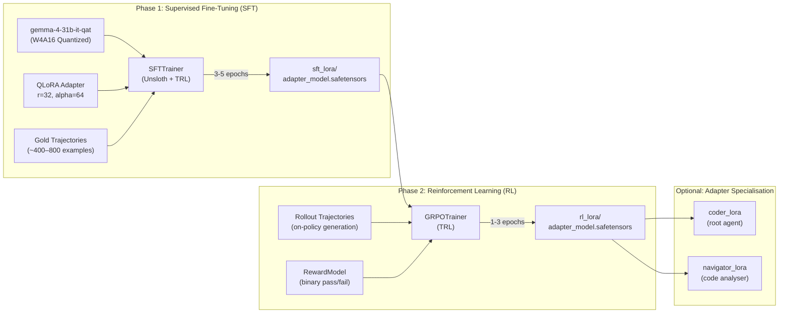

# 04 — Training Strategy

---

## 1. Two-Phase Training Architecture



---

## 2. Phase 1: Supervised Fine-Tuning (SFT)

### 2.1 Objective

Teach the model to:
1. Emit syntactically perfect `<|tool_call|>` JSON blocks with correct Gemma 4 chat template tokens
2. Follow the `think → navigate → diagnose → patch → verify → submit` workflow
3. Use the correct tool signatures for all 9 harness tools
4. Write `edit_file` calls with precise `old_string` matching
5. Place scratch files in `/tmp/` never `/workspace/`

### 2.2 QLoRA Configuration

```yaml
# configs/sft_config.yaml
model:
  name: "google/gemma-4-31b-it-qat-w4a16-ct"
  load_in_4bit: true               # Already W4A16, use as-is with Unsloth
  max_seq_length: 32768
  dtype: "bfloat16"                # Compute dtype

lora:
  r: 32                            # Rank (balance: quality vs size)
  lora_alpha: 64                   # Scaling factor (2×r)
  lora_dropout: 0.05
  target_modules:                  # All linear projections
    - q_proj
    - k_proj
    - v_proj
    - o_proj
    - gate_proj
    - up_proj
    - down_proj
  bias: "none"
  task_type: "CAUSAL_LM"
  # Estimated adapter size at r=32: ~220-450 MB → fits 4-6 within 3 GiB

training:
  num_epochs: 5
  per_device_train_batch_size: 1   # 4×L4 with gradient accumulation
  gradient_accumulation_steps: 8   # Effective batch size = 8
  learning_rate: 2.0e-4
  lr_scheduler_type: "cosine"
  warmup_ratio: 0.05
  weight_decay: 0.01
  max_grad_norm: 1.0
  bf16: true
  gradient_checkpointing: true     # Critical for 31B on 4×L4

  # Token-length regularisation
  max_seq_length: 28672            # Leave 4K headroom for safety
  packing: true                    # Pack short trajectories together

  # Early stopping
  eval_strategy: "steps"
  eval_steps: 50
  save_strategy: "steps"
  save_steps: 50
  load_best_model_at_end: true
  metric_for_best_model: "eval_loss"
  greater_is_better: false
  save_total_limit: 3

  # Logging
  logging_steps: 10
  report_to: "none"                # We use custom TelemetryLogger
```

### 2.3 SFT Training Pseudocode

```python
class SFTTrainerPipeline:
    """Orchestrates QLoRA SFT on gold trajectories."""
    
    def run(self, config: SFTConfig, dataset: Dataset) -> Path:
        # 1. Load base model with Unsloth 4-bit optimisation
        model, tokenizer = FastLanguageModel.from_pretrained(
            model_name=config.model.name,
            max_seq_length=config.model.max_seq_length,
            dtype=config.model.dtype,
            load_in_4bit=config.model.load_in_4bit,
        )
        
        # 2. Apply LoRA adapters
        model = FastLanguageModel.get_peft_model(
            model,
            r=config.lora.r,
            lora_alpha=config.lora.lora_alpha,
            lora_dropout=config.lora.lora_dropout,
            target_modules=config.lora.target_modules,
            bias=config.lora.bias,
        )
        
        # 3. Split dataset by fold
        train_ds = dataset.filter(lambda x: x["fold"] != config.eval_fold)
        val_ds = dataset.filter(lambda x: x["fold"] == config.eval_fold)
        
        # 4. Configure TRL SFTTrainer
        trainer = SFTTrainer(
            model=model,
            tokenizer=tokenizer,
            train_dataset=train_ds,
            eval_dataset=val_ds,
            args=TrainingArguments(**config.training.to_dict()),
            callbacks=[TelemetryCallback(config.log_path)],
            dataset_text_field="formatted_text",  # Pre-formatted chat text
            max_seq_length=config.training.max_seq_length,
            packing=config.training.packing,
        )
        
        # 5. Train
        trainer.train()
        
        # 6. Save adapter in safetensors format
        adapter_path = config.output_dir / "sft_lora"
        model.save_pretrained(adapter_path, safe_serialization=True)
        
        # 7. Validate adapter size
        total_size = sum(f.stat().st_size for f in adapter_path.rglob("*"))
        assert total_size < 1_500_000_000, f"Adapter too large: {total_size} bytes"
        
        return adapter_path
```

### 2.4 Data Curriculum Strategy

Train in a curriculum that progresses from simple to complex:

| Epoch Range | Data Mix | Rationale |
|---|---|---|
| Epochs 1-2 | 100% SIMPLE tasks (1 file, <20 lines) | Learn basic tool-call syntax |
| Epochs 3-4 | 50% SIMPLE + 50% MODERATE | Build multi-file navigation |
| Epoch 5 | 33% each tier | Full complexity exposure |

---

## 3. Phase 2: Reinforcement Learning (RL)

### 3.1 Objective

Maximise the agent's actual resolution rate through outcome-based rewards, teaching:
1. Efficient tool usage (fewer calls → higher reward)
2. Correct bug diagnosis under ambiguous problem statements
3. Robust patch generation that passes all test cases
4. Context budget management

### 3.2 Reward Model Design

```python
class RewardModel:
    """Binary pass/fail reward from local pytest execution."""
    
    _PASS_REWARD: float = 1.0
    _FAIL_REWARD: float = -0.5
    _PARTIAL_REWARD: float = 0.3
    _TOOL_EFFICIENCY_BONUS: float = 0.1
    _TRUNCATION_PENALTY: float = -0.2
    
    def compute_reward(self, trajectory: Trajectory, task: Task) -> float:
        reward = self._FAIL_REWARD  # Default: failed
        
        # 1. Apply the agent's patch and run tests
        patch_result = self._apply_and_test(trajectory.patch, task)
        
        if patch_result.all_tests_pass:
            reward = self._PASS_REWARD
        elif patch_result.some_tests_pass:
            reward = self._PARTIAL_REWARD * patch_result.pass_ratio
        
        # 2. Efficiency bonus: fewer tool calls → bonus
        if trajectory.num_tool_calls < task.median_tool_calls:
            reward += self._TOOL_EFFICIENCY_BONUS
        
        # 3. Truncation penalty: penalise token overflow
        if trajectory.had_truncation:
            reward += self._TRUNCATION_PENALTY
        
        return reward
```

### 3.3 GRPO Configuration

```yaml
# configs/rl_config.yaml
model:
  name: "google/gemma-4-31b-it-qat-w4a16-ct"
  adapter_path: "./checkpoints/sft_lora"  # Start from SFT checkpoint

grpo:
  num_generations: 4               # Generate 4 completions per prompt
  max_new_tokens: 16384
  temperature: 0.7                 # Exploration temperature
  top_p: 0.95
  
  # Advantage estimation
  beta: 0.1                        # KL penalty coefficient
  
  # Training
  num_epochs: 2
  per_device_train_batch_size: 1
  gradient_accumulation_steps: 4
  learning_rate: 5.0e-5            # Lower LR than SFT
  lr_scheduler_type: "cosine"
  warmup_ratio: 0.1
  max_grad_norm: 0.5               # Tighter gradient clipping

  # Reward
  reward_model: "binary_pytest"    # Uses RewardModel class
  
  # Safety
  max_trajectory_tokens: 28672
  discard_truncated: true          # Don't reward truncated trajectories
```

### 3.4 GRPO Training Pseudocode

```python
class RLTrainerPipeline:
    """GRPO reinforcement learning on rollout trajectories."""
    
    def run(self, config: RLConfig, tasks: list[Task]) -> Path:
        # 1. Load SFT checkpoint
        model, tokenizer = FastLanguageModel.from_pretrained(
            model_name=config.model.name,
            max_seq_length=32768,
            load_in_4bit=True,
        )
        model = PeftModel.from_pretrained(model, config.model.adapter_path)
        model = model.merge_and_unload()  # Merge SFT adapter
        
        # 2. Re-apply fresh LoRA for RL training
        model = FastLanguageModel.get_peft_model(
            model, r=32, lora_alpha=64,
            target_modules=["q_proj", "k_proj", "v_proj", "o_proj",
                            "gate_proj", "up_proj", "down_proj"],
        )
        
        # 3. Build prompts from tasks
        prompts = [self._build_prompt(task) for task in tasks]
        
        # 4. Configure GRPO Trainer
        trainer = GRPOTrainer(
            model=model,
            tokenizer=tokenizer,
            reward_funcs=[RewardModel()],
            args=GRPOConfig(**config.grpo.to_dict()),
            train_dataset=prompts,
        )
        
        # 5. Train with rollout generation
        trainer.train()
        
        # 6. Save RL adapter
        adapter_path = config.output_dir / "rl_lora"
        model.save_pretrained(adapter_path, safe_serialization=True)
        
        return adapter_path
```

### 3.5 Alternative: DPO (if GRPO is too expensive)

If on-policy rollout generation is too slow on 4×L4:

```yaml
dpo:
  beta: 0.1
  loss_type: "sigmoid"             # Standard DPO loss
  # Generate preference pairs offline:
  #   - "chosen": trajectory that resolves the task
  #   - "rejected": trajectory that fails or uses excessive tool calls
  max_length: 28672
  max_prompt_length: 4096
  num_epochs: 2
  per_device_train_batch_size: 1
  gradient_accumulation_steps: 4
  learning_rate: 5.0e-6
```

---

## 4. Adapter Specialisation Strategy

### 4.1 Single-Adapter vs Multi-Adapter

| Strategy | Pros | Cons |
|---|---|---|
| **Single adapter** (`coder_lora`) | Simpler, more training data per adapter | No specialisation |
| **Dual adapter** (`coder_lora` + `navigator_lora`) | Root coder focuses on patches; navigator focuses on efficient code search | Split training data, more complex |
| **Triple adapter** (`coder_lora` + `navigator_lora` + `verifier_lora`) | Dedicated verification agent | Diminishing returns, size budget |

**Recommended**: Start with **single adapter** for V1. If local CV shows the model struggles with navigation efficiency, split into dual adapters in V2.

### 4.2 Adapter Size Budget Plan

| Adapter | Rank | Est. Size | Allocation |
|---|---|---|---|
| `coder_lora` (V1) | r=32 | ~350 MB | Primary |
| `navigator_lora` (V2) | r=16 | ~175 MB | If dual-adapter needed |
| **Total V1** | — | **~350 MB** | **11% of 3 GiB budget** |
| **Total V2** | — | **~525 MB** | **16% of 3 GiB budget** |

> The remaining ~2.7 GiB is consumed by prompts, YAML configs, and skills (negligible). The extreme headroom is intentional — adapter quality matters far more than size.

---

## 5. Training Telemetry Contract

Every training run must log the following to `./logs/run_vX.Y.Z.log`:

```json
{
  "version": "0.1.0",
  "timestamp": "2026-09-29T03:00:00Z",
  "phase": "sft",
  "epoch": 3,
  "step": 150,
  "train_loss": 0.423,
  "eval_loss": 0.512,
  "learning_rate": 1.8e-4,
  "grad_norm": 0.89,
  "tokens_per_second": 1240,
  "gpu_memory_allocated_gb": [18.2, 18.1, 18.3, 18.0],
  "adapter_size_bytes": 356000000,
  "eval_metrics": {
    "tool_call_syntax_accuracy": 0.98,
    "trajectory_completion_rate": 0.95,
    "avg_token_count": 18500
  }
}
```
