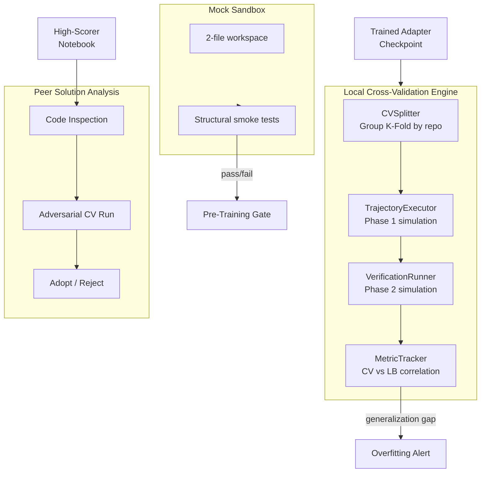

# 05 — Evaluation Framework

---

## 1. Evaluation Architecture



---

## 2. Cross-Validation Framework (`CVEvaluator`)

### 2.1 Splitting Strategy

```python
class CVSplitter:
    """Deterministic Group K-Fold splitter for SWE-bench tasks."""
    
    _NUM_FOLDS: int = 4
    _RANDOM_SEED: int = 42
    
    def create_splits(self, tasks: list[Task]) -> list[CVFold]:
        # Primary: Group K-Fold by repository
        # Each fold holds out one entire repository:
        #   Fold 0: val=fastapi     (large, ~70 tasks)
        #   Fold 1: val=rich        (~20 tasks)
        #   Fold 2: val=requests    (~20 tasks)
        #   Fold 3: val=httpx       (~20 tasks)
        
        groups = [task.repo.split("/")[1] for task in tasks]
        gkf = GroupKFold(n_splits=self._NUM_FOLDS)
        
        folds = []
        for fold_idx, (train_idx, val_idx) in enumerate(
            gkf.split(tasks, groups=groups)
        ):
            folds.append(CVFold(
                fold_idx=fold_idx,
                train_ids=[tasks[i].instance_id for i in train_idx],
                val_ids=[tasks[i].instance_id for i in val_idx],
                val_repo=groups[val_idx[0]],
            ))
        
        return folds
```

### 2.2 Stratified Complexity Sub-Split

Within each fold, we further stratify by task complexity:

```python
def stratify_within_fold(self, fold: CVFold, tasks: list[Task]) -> CVFold:
    # Ensure each complexity tier is proportionally represented
    # SIMPLE / MODERATE / COMPLEX classification:
    #   SIMPLE:   1 file changed, <20 lines in patch
    #   MODERATE: 1-3 files, 20-100 lines
    #   COMPLEX:  >3 files or >100 lines
    
    val_tasks = [t for t in tasks if t.instance_id in fold.val_ids]
    complexity_dist = Counter(self._classify(t) for t in val_tasks)
    # Log distribution for monitoring
    return fold  # GroupKFold naturally handles this via repo grouping
```

### 2.3 Evaluation Pipeline

```python
class CVEvaluator:
    """End-to-end cross-validation simulating the competition harness."""
    
    def evaluate_checkpoint(
        self, adapter_path: Path, fold: CVFold, tasks: list[Task]
    ) -> CVResult:
        val_tasks = [t for t in tasks if t.instance_id in fold.val_ids]
        results = []
        
        for task in val_tasks:
            # Phase 1: Execute agent trajectory
            trajectory = self._executor.execute(
                adapter_path=adapter_path,
                task=task,
                max_tool_calls=100,
                max_time_minutes=60,
            )
            
            # Phase 2: Verify patch
            if trajectory.patch:
                verification = self._verifier.verify(
                    patch=trajectory.patch,
                    task=task,
                )
            else:
                verification = VerificationResult(resolved=False)
            
            results.append(TaskResult(
                instance_id=task.instance_id,
                resolved=verification.resolved,
                tool_calls_used=trajectory.num_tool_calls,
                tokens_used=trajectory.total_tokens,
                had_truncation=trajectory.had_truncation,
                time_seconds=trajectory.elapsed_seconds,
            ))
        
        # Compute aggregate metrics
        resolution_rate = sum(r.resolved for r in results) / len(results)
        
        return CVResult(
            fold_idx=fold.fold_idx,
            val_repo=fold.val_repo,
            resolution_rate=resolution_rate,
            per_task_results=results,
            avg_tool_calls=mean(r.tool_calls_used for r in results),
            avg_tokens=mean(r.tokens_used for r in results),
            truncation_rate=mean(r.had_truncation for r in results),
        )
```

---

## 3. Phase 1 Simulation (`TrajectoryExecutor`)

### 3.1 Execution Modes

| Mode | Description | When Used |
|---|---|---|
| **Full Execution** | Run vLLM inference + tool execution in Docker sandbox | Final validation before submission |
| **Cached Execution** | Replay pre-generated trajectories, only execute tools | Rapid iteration during prompt tuning |
| **Dry Run** | Parse trajectory, validate tool-call syntax only | CI pipeline structural tests |

### 3.2 Tool Budget Simulation

```python
class TrajectoryExecutor:
    """Simulates Phase 1 agent execution with budget enforcement."""
    
    _MAX_TOOL_CALLS: int = 100
    _MAX_TIME_MINUTES: float = 60.0
    _COMMAND_TIMEOUT: int = 300
    _MAX_STDOUT_CHARS: int = 5000
    _MAX_FILE_LINES: int = 150
    _MAX_FILE_CHARS: int = 10000
    
    def execute(self, adapter_path: Path, task: Task, **kwargs) -> Trajectory:
        # Load model with adapter
        # Generate turn-by-turn with tool execution
        # Enforce all budget limits identically to swegemma harness
        # Return complete trajectory with metrics
        ...
```

---

## 4. Phase 2 Simulation (`VerificationRunner`)

### 4.1 Exact Harness Replication

The verification runner must replicate the Phase 2 container exactly:

```python
class VerificationRunner:
    """Simulates Phase 2 verification in a clean sandbox."""
    
    def verify(self, patch: str, task: Task) -> VerificationResult:
        # 1. Extract fresh snapshot at base_commit
        self._extract_snapshot(task)
        
        # 2. Install in editable mode
        self._install_editable()
        
        # 3. Create baseline commit
        self._create_baseline_commit()
        
        # 4. Apply agent patch (4-pass resilient)
        patch_applied = self._apply_patch(patch)
        if not patch_applied:
            return VerificationResult(resolved=False, error="Patch application failed")
        
        # 5. CRITICAL: Reset test files to baseline
        self._reset_protected_files(task)
        
        # 6. Apply test_patch
        self._apply_test_patch(task.test_patch)
        
        # 7. Run pytest with JUnit XML
        test_result = self._run_pytest(task)
        
        # 8. Validate: exit_code == 0 AND JUnit XML passes
        resolved = (
            test_result.exit_code == 0
            and test_result.passed_tests > 0
            and test_result.failures == 0
            and test_result.errors == 0
        )
        
        return VerificationResult(resolved=resolved, test_result=test_result)
```

### 4.2 Anti-Tampering Simulation

```python
def _reset_protected_files(self, task: Task) -> None:
    """Replicate harness anti-tampering: discard agent changes to tests."""
    # Files referenced in test_patch
    test_patch_files = self._parse_patch_files(task.test_patch)
    
    # Protected patterns: test_*.py, *_test.py, conftest.py, pytest.ini, etc.
    protected = [f for f in self._list_changed_files() 
                 if self._is_protected(f)]
    
    all_reset = set(test_patch_files) | set(protected)
    for filepath in all_reset:
        self._run("git checkout HEAD -- " + filepath)
        self._run("git clean -f -- " + filepath)
```

---

## 5. Mock Sandbox (`MockSandbox`)

### 5.1 Purpose

Lightweight testing environment for local machines with limited resources. Validates:
- Tool-call JSON syntax correctness
- Chat template token formatting
- Pipeline structural integrity
- Config file schema validity

### 5.2 Mock Workspace Structure

```
/tmp/mock_workspace/
├── utils.py          # Contains intentional bug
├── __init__.py       # Empty
└── .git/             # Minimal git repo
```

### 5.3 Mock Task Definition

```python
MOCK_TASK = Task(
    instance_id="mock_utils_001",
    repo="mock/utils-lib",
    base_commit="abc123",
    problem_statement=(
        "The `add_numbers` function in utils.py has an off-by-one error. "
        "When called with add_numbers(2, 3), it returns 6 instead of 5."
    ),
    hints_text="Check the return statement in add_numbers().",
    patch=textwrap.dedent("""\
        --- a/utils.py
        +++ b/utils.py
        @@ -3,4 +3,4 @@ def add_numbers(a, b):
        -    return a + b + 1
        +    return a + b
    """),
    test_patch=textwrap.dedent("""\
        --- /dev/null
        +++ b/tests/test_utils.py
        @@ -0,0 +1,5 @@
        +def test_add_numbers():
        +    from utils import add_numbers
        +    assert add_numbers(2, 3) == 5
        +    assert add_numbers(0, 0) == 0
        +    assert add_numbers(-1, 1) == 0
    """),
)
```

### 5.4 Smoke Test Suite

```python
class MockSmokeTests:
    """Fast structural validation tests runnable on any machine."""
    
    def test_chat_template_formatting(self):
        """Verify Gemma 4 chat template tokens are correctly applied."""
        
    def test_tool_call_json_syntax(self):
        """Verify all tool calls are valid JSON with correct signatures."""
        
    def test_trajectory_token_budget(self):
        """Verify no trajectory exceeds 28K tokens."""
        
    def test_adapter_safetensors_format(self):
        """Verify adapter is saved as .safetensors, not .bin/.pt."""
        
    def test_submission_size_constraint(self):
        """Verify total submission < 3 GiB."""
        
    def test_agent_yaml_schema(self):
        """Verify agent.yaml compiles without errors."""
        
    def test_no_workspace_scratch_files(self):
        """Verify trajectories don't write to /workspace/ for scratch."""
        
    def test_no_test_file_modifications(self):
        """Verify patches don't modify test_*.py or conftest.py."""
```

---

## 6. Overfitting Detection (`MetricTracker`)

### 6.1 Tracking Protocol

```python
class MetricTracker:
    """Track local CV vs public LB to detect overfitting."""
    
    _GENERALIZATION_GAP_THRESHOLD: float = 0.15
    
    def record(self, version: str, cv_score: float, lb_score: float | None) -> None:
        entry = MetricEntry(
            version=version,
            timestamp=datetime.utcnow(),
            cv_resolution_rate=cv_score,
            lb_resolution_rate=lb_score,  # None if not yet submitted
            gap=abs(cv_score - lb_score) if lb_score else None,
        )
        self._history.append(entry)
        
        # Alert if gap exceeds threshold
        if entry.gap and entry.gap > self._GENERALIZATION_GAP_THRESHOLD:
            self._alert_overfitting(entry)
    
    def detect_trend(self) -> OverfittingSignal:
        # Compute moving average of gap over last 5 submissions
        # If gap is increasing while CV is increasing but LB is flat/decreasing
        # → Strong overfitting signal
        recent = self._history[-5:]
        cv_trend = self._linear_trend([e.cv_resolution_rate for e in recent])
        lb_trend = self._linear_trend([e.lb_resolution_rate for e in recent if e.lb_resolution_rate])
        
        if cv_trend > 0 and lb_trend <= 0:
            return OverfittingSignal.STRONG
        elif cv_trend > 0 and lb_trend > 0 and cv_trend > 2 * lb_trend:
            return OverfittingSignal.MODERATE
        else:
            return OverfittingSignal.NONE
```

### 6.2 Early Stopping Criteria

| Signal | Action |
|---|---|
| `NONE` | Continue training |
| `MODERATE` | Reduce learning rate by 50%, increase trajectory augmentation diversity |
| `STRONG` | Stop training, revert to last checkpoint where `gap < threshold` |

### 6.3 Token Length Regularisation

```python
def compute_length_penalty(self, trajectory: Trajectory) -> float:
    """Penalise trajectories that are excessively long."""
    token_count = trajectory.total_tokens
    if token_count > 24000:
        # Quadratic penalty beyond 24K tokens
        excess = (token_count - 24000) / 4000
        return -0.1 * excess ** 2
    return 0.0
```
