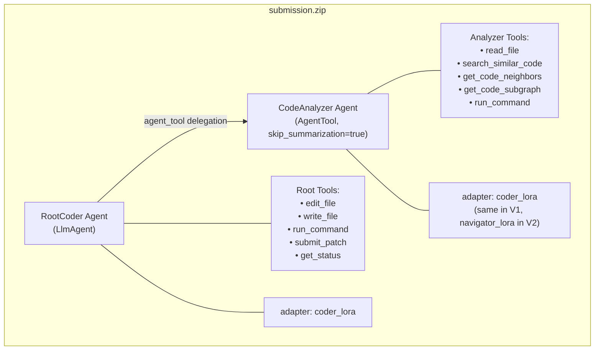
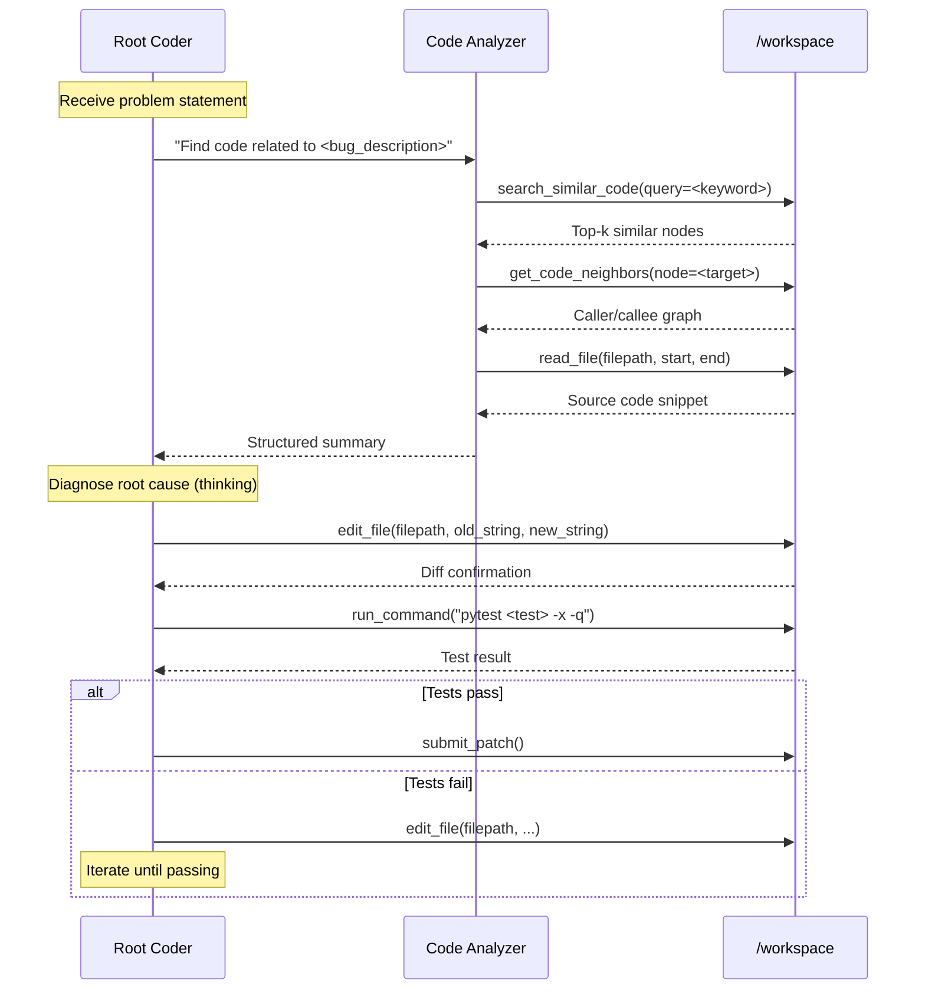

# 06 — Agent Architecture (Runtime)

---

## 1. Agent Tree Design



---

## 2. Agent Configuration Files

### 2.1 Root Agent (`agent.yaml`)

```yaml
name: root_coder
model: gemma-4-31b-it-qat-w4a16-ct
adapter: coder_lora

instruction: !include prompts/system.md

tools:
  - edit_file
  - write_file
  - run_command
  - submit_patch
  - get_status
  - agent_tool:
      config_path: sub_agents/code_analyzer.yaml
      skip_summarization: true  # Keep analyzer outputs out of root context

generate_content_config:
  max_output_tokens: 16384
  temperature: 0.2
  top_p: 0.95
  top_k: 40
  thinking_config:
    include_thoughts: true
    thinking_budget: 4096
```

### 2.2 Code Analyzer Sub-Agent (`sub_agents/code_analyzer.yaml`)

```yaml
name: code_analyzer
agent_class: LlmAgent
model: gemma-4-31b-it-qat-w4a16-ct
adapter: coder_lora

description: |
  Read-only code analysis agent. Use this to explore repository structure,
  read files, search for code patterns, and understand call graphs.
  Returns a structured summary of findings.

instruction: !include prompts/navigator.md

tools:
  - read_file
  - search_similar_code
  - get_code_neighbors
  - get_code_subgraph
  - run_command

generate_content_config:
  max_output_tokens: 8192
  temperature: 0.1
  thinking_config:
    include_thoughts: true
    thinking_budget: 2048
```

### 2.3 Evaluation Config (`eval_config.yaml`)

```yaml
evaluation:
  max_time_minutes: 30       # 30 min per task (2× safety margin for 12h/~120 tasks)
  max_tool_calls: 75         # Conservative; leave headroom
  max_turns: 200             # Generous turn limit
  timeout_seconds: 300       # Per-command timeout
```

---

## 3. System Prompt Design (`prompts/system.md`)

```markdown
You are an expert software engineer tasked with fixing bugs in Python repositories.

## Core Workflow
1. **UNDERSTAND**: Read the problem statement carefully. Identify the affected module(s).
2. **NAVIGATE**: Use the code_analyzer tool to efficiently explore the codebase.
   - Start with `search_similar_code` to find relevant functions/classes.
   - Use `get_code_neighbors` to understand the call graph around affected symbols.
   - Only `read_file` specific sections you need — never read entire large files.
3. **DIAGNOSE**: Articulate the root cause in your thinking before making any edits.
4. **PATCH**: Apply minimal, focused fixes using `edit_file`.
   - Use small, precise `old_string` values (3-10 lines) for reliable matching.
   - Never modify test files (test_*.py, conftest.py, pytest.ini, pyproject.toml).
   - Apply one edit at a time and verify before making the next.
5. **VERIFY**: Run targeted tests to confirm your fix.
   - Use: `run_command("cd /workspace && python -m pytest <specific_test> -x -q")`
   - If tests are unknown, try: `run_command("cd /workspace && python -c '<quick_assertion>'")`
6. **SUBMIT**: Call `submit_patch()` when all changes are verified.

## Critical Rules
- Work ONLY in `/workspace`. Put temporary scripts in `/tmp/`, NEVER in `/workspace/`.
- Do NOT modify test files — they will be reset by the verifier.
- Do NOT install packages — everything is pre-installed offline.
- Keep edits minimal — only change what's needed to fix the bug.
- Call `get_status()` periodically (it's free) to check remaining budget.
- If your tool call is being truncated, split into smaller operations.

## Context Efficiency
- Prefer code intelligence tools over raw grep for initial navigation.
- Summarise file contents in your thinking rather than re-reading.
- Delegate complex code exploration to the code_analyzer tool.

{problem_description}
```

### 3.1 Navigator Prompt (`prompts/navigator.md`)

```markdown
You are a code navigation specialist. Your job is to explore a Python repository
and return a structured summary of your findings.

When asked to investigate a topic:
1. Use `search_similar_code` to find relevant symbols.
2. Use `get_code_neighbors` to map the call/dependency graph.
3. Use `read_file` to examine specific implementations (only the lines you need).
4. Return a concise summary with:
   - File paths and line numbers of relevant code
   - Function/class signatures
   - Key logic that relates to the query
   - Suggested areas that may contain the bug

Keep your response under 2000 tokens. Do NOT suggest fixes — only report findings.
```

---

## 4. Tool Usage Strategy

### 4.1 Optimal Tool Call Sequence



### 4.2 Tool Budget Allocation Plan

| Phase | Tool Calls | Percentage |
|---|---|---|
| Navigation (via analyzer) | 15-25 | 20-33% |
| Diagnosis (read_file direct) | 5-10 | 7-13% |
| Patching (edit_file) | 5-15 | 7-20% |
| Verification (run_command) | 5-10 | 7-13% |
| Status checks (get_status) | 3-5 | Free |
| Submit (submit_patch) | 1 | Free |
| **Total** | **30-60** | **of 75 budget** |

### 4.3 Error Recovery Patterns

| Error | Recovery Strategy |
|---|---|
| `edit_file` returns `FileEditError` (multiple matches) | Re-read the target file, use a larger `old_string` with more context lines |
| `edit_file` returns `FileEditError` (no match) | Read the file again; the content may have changed from a previous edit |
| `run_command` timeout | Simplify the command; avoid running full test suites |
| `read_file` truncated | Use `start_line`/`end_line` to paginate through the file |
| Token truncation (nudge received) | Emit tool call immediately without repeating reasoning |
| Budget warning (<10 calls remaining) | Immediately finalise edits and call `submit_patch()` |

---

## 5. Context Window Management

### 5.1 ADK Compaction Interaction

The ADK `EventsCompactionConfig` will automatically compress old events:
- **Threshold**: 14,336 tokens
- **Interval**: Every 5 events
- **Overlap**: 2 recent events preserved in full

**Agent Training Requirement**: The model must be trained on trajectories where early tool results are summarised/compacted, so it can continue reasoning from compressed history.

### 5.2 Token Budget Planning Per Turn

```
System instruction:   ~2,000 tokens (fixed)
Conversation history: ~8,000 tokens (compacted)
Thinking budget:      ~4,096 tokens (configurable)
Tool call output:     ~1,000 tokens (per call)
Generation output:    ~16,384 tokens max
────────────────────────────────────
Total:                ~32,000 tokens (within 32K limit)
```

### 5.3 Strategies to Prevent Truncation

1. **Incremental edits**: Split large patches into multiple small `edit_file` calls
2. **Targeted reads**: Always specify `start_line`/`end_line` in `read_file`
3. **Concise thinking**: System prompt instructs "keep reasoning under a few sentences"
4. **Delegation**: Heavy code exploration delegated to analyzer sub-agent (isolated context)
5. **Budget checks**: Periodic `get_status()` calls to monitor remaining resources
