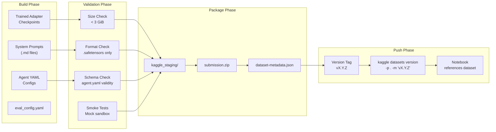

# 07 — Deployment Strategy

---

## 1. Deployment Pipeline



---

## 2. Submission Packager (`SubmissionPackager`)

### 2.1 Assembly Process

```python
class SubmissionPackager:
    """Assembles and validates the final submission.zip."""
    
    _MAX_TOTAL_SIZE: int = 3_221_225_472  # 3 GiB
    _REQUIRED_FILES: list[str] = ["agent.yaml"]
    _ALLOWED_EXTENSIONS: set[str] = {
        ".yaml", ".yml", ".md", ".txt", ".py",
        ".json", ".safetensors",
    }
    _FORBIDDEN_EXTENSIONS: set[str] = {".bin", ".pt", ".pth", ".pkl", ".pickle"}
    
    def package(self, config: DeployConfig) -> Path:
        staging_dir = config.staging_dir  # ./kaggle_staging/
        
        # 1. Clean staging directory (preserve dataset-metadata.json)
        self._clean_staging(staging_dir)
        
        # 2. Copy agent YAML configs
        self._copy_yaml_configs(config.yaml_source, staging_dir)
        
        # 3. Copy prompt templates
        self._copy_prompts(config.prompt_source, staging_dir / "prompts")
        
        # 4. Copy sub-agent configs
        self._copy_sub_agents(config.sub_agent_source, staging_dir / "sub_agents")
        
        # 5. Copy adapter checkpoints (safetensors only)
        for adapter in config.adapters:
            self._copy_adapter(adapter.path, staging_dir / "adapters" / adapter.name)
        
        # 6. Copy skills (if any)
        self._copy_skills(config.skills_source, staging_dir / "skills")
        
        # 7. Copy eval_config.yaml
        self._copy_eval_config(config.eval_config, staging_dir)
        
        # 8. Run pre-flight validation
        self._validate(staging_dir)
        
        # 9. Create submission.zip
        zip_path = self._create_zip(staging_dir, config.output_path)
        
        return zip_path
```

### 2.2 Pre-Flight Validation (`ConstraintValidator`)

```python
class ConstraintValidator:
    """Validates all submission constraints before packaging."""
    
    def validate(self, staging_dir: Path) -> ValidationReport:
        checks = []
        
        # 1. Root config exists
        checks.append(self._check_root_config(staging_dir))
        
        # 2. Total size < 3 GiB
        total_size = self._compute_total_size(staging_dir)
        checks.append(ValidationCheck(
            name="total_size",
            passed=total_size < self._MAX_TOTAL_SIZE,
            detail=f"{total_size:,} bytes ({total_size / 1e9:.2f} GB)",
        ))
        
        # 3. No forbidden file extensions
        checks.append(self._check_extensions(staging_dir))
        
        # 4. Adapter format (safetensors + adapter_config.json)
        checks.append(self._check_adapters(staging_dir))
        
        # 5. YAML schema validity (all files parseable, no path traversal)
        checks.append(self._check_yaml_schema(staging_dir))
        
        # 6. Single model declaration
        checks.append(self._check_single_model(staging_dir))
        
        # 7. No symlinks
        checks.append(self._check_no_symlinks(staging_dir))
        
        # 8. Adapter count ≤ 8
        checks.append(self._check_adapter_count(staging_dir))
        
        # 9. Max LoRA rank ≤ 128
        checks.append(self._check_lora_rank(staging_dir))
        
        # 10. Token limits in generate_content_config
        checks.append(self._check_token_limits(staging_dir))
        
        report = ValidationReport(checks=checks, all_passed=all(c.passed for c in checks))
        
        if not report.all_passed:
            failed = [c for c in checks if not c.passed]
            raise ConstraintViolation(
                f"{len(failed)} pre-flight checks failed:\n" +
                "\n".join(f"  ✗ {c.name}: {c.detail}" for c in failed)
            )
        
        return report
```

---

## 3. Version Manager (`VersionManager`)

### 3.1 Semantic Versioning Scheme

```
vMAJOR.MINOR.PATCH

MAJOR: Architecture changes (agent tree restructure, new sub-agents)
MINOR: Training improvements (new adapter checkpoint, prompt changes)
PATCH: Bug fixes (typo in prompt, config tweak)

Examples:
  v0.1.0  — First SFT adapter, baseline prompts
  v0.2.0  — RL fine-tuned adapter
  v0.2.1  — Prompt tweak for better edit_file precision
  v1.0.0  — Dual-adapter architecture with navigator
  v1.1.0  — GRPO-trained with new reward model
```

### 3.2 Version Management Workflow

```python
class VersionManager:
    """Auto-increment versions and push via Kaggle CLI."""
    
    _VERSION_FILE: str = "VERSION"
    _CHANGELOG_FILE: str = "CHANGELOG.md"
    
    def bump(self, bump_type: str, message: str) -> str:
        current = self._read_version()
        major, minor, patch = current.split(".")
        
        if bump_type == "major":
            new = f"{int(major)+1}.0.0"
        elif bump_type == "minor":
            new = f"{major}.{int(minor)+1}.0"
        else:
            new = f"{major}.{minor}.{int(patch)+1}"
        
        self._write_version(new)
        self._update_changelog(new, message)
        
        return new
    
    def push(self, staging_dir: Path, version: str, message: str) -> None:
        # 1. Run pre-flight validation
        validator = ConstraintValidator()
        validator.validate(staging_dir)
        
        # 2. Push to Kaggle
        cmd = f'kaggle datasets version -p {staging_dir} -m "v{version}: {message}"'
        result = subprocess.run(cmd, shell=True, capture_output=True, text=True)
        
        if result.returncode != 0:
            raise DeploymentError(f"Kaggle push failed: {result.stderr}")
        
        # 3. Log deployment
        self._log_deployment(version, message)
```

### 3.3 Deployment Checklist

```python
class DeploymentOrchestrator:
    """End-to-end deployment pipeline with safety gates."""
    
    def deploy(self, config: DeployConfig) -> DeploymentResult:
        # Gate 1: Local CV score meets threshold
        cv_result = self._run_cv(config.adapter_path)
        if cv_result.resolution_rate < config.min_cv_threshold:
            raise DeploymentGate(
                f"CV score {cv_result.resolution_rate:.3f} below "
                f"threshold {config.min_cv_threshold:.3f}"
            )
        
        # Gate 2: No overfitting signal
        signal = self._tracker.detect_trend()
        if signal == OverfittingSignal.STRONG:
            raise DeploymentGate("Strong overfitting detected")
        
        # Gate 3: Smoke tests pass
        smoke_results = self._run_smoke_tests(config)
        if not smoke_results.all_passed:
            raise DeploymentGate(f"Smoke tests failed: {smoke_results}")
        
        # Gate 4: Constraint validation passes
        packager = SubmissionPackager()
        zip_path = packager.package(config)
        
        # Gate 5: Version bump and push
        version = self._version_mgr.bump(config.bump_type, config.message)
        self._version_mgr.push(config.staging_dir, version, config.message)
        
        return DeploymentResult(
            version=version,
            zip_path=zip_path,
            cv_score=cv_result.resolution_rate,
            size_bytes=zip_path.stat().st_size,
        )
```

---

## 4. Kaggle Notebook Integration

### 4.1 Training Notebook Structure (`notebooks/train_notebook.ipynb`)

```python
# Cell 1: Install package
!pip install -e /kaggle/input/gemma4-dev-agent-code/src

# Cell 2: Import pipeline
from src.config.config_manager import ConfigManager
from src.data.dataset_builder import DatasetBuilder
from src.training.sft_trainer import SFTTrainerPipeline
from src.training.rl_trainer import RLTrainerPipeline
from src.deployment.submission_packager import SubmissionPackager

# Cell 3: Configure
config = ConfigManager.load("/kaggle/input/gemma4-dev-agent-code/configs/sft_config.yaml")

# Cell 4: Build dataset
dataset = DatasetBuilder(config).build()

# Cell 5: SFT Training
sft_pipeline = SFTTrainerPipeline()
sft_adapter = sft_pipeline.run(config.sft, dataset)

# Cell 6: RL Training (optional)
rl_pipeline = RLTrainerPipeline()
rl_adapter = rl_pipeline.run(config.rl, dataset.tasks)

# Cell 7: Package submission
packager = SubmissionPackager()
submission = packager.package(config.deploy)
```

### 4.2 Output Artifacts

```
/kaggle/working/
├── submission.zip              # Final submission archive
├── submission/                 # Unpacked staging directory
│   ├── agent.yaml
│   ├── eval_config.yaml
│   ├── prompts/
│   ├── sub_agents/
│   └── adapters/
├── checkpoints/
│   ├── sft_lora/               # SFT checkpoint
│   └── rl_lora/                # RL checkpoint
└── logs/
    └── run_v0.1.0.log          # Training telemetry
```

---

## 5. CI/CD Workflow

### 5.1 Local Pre-Commit Pipeline

```bash
# 1. Lint
ruff check src/ tests/

# 2. Type check
mypy src/

# 3. Unit tests with mock mode
pytest tests/unit/ -v --cov=src --cov-report=term-missing

# 4. Integration tests with mock sandbox
pytest tests/integration/ -v -k "mock"

# 5. Smoke tests
pytest tests/unit/ -v -k "smoke"

# 6. Constraint validation
python -m src.deployment.constraint_validator --staging-dir ./kaggle_staging
```

### 5.2 Pre-Submission Checklist

| Check | Command | Pass Criteria |
|---|---|---|
| Lint | `ruff check src/` | Zero violations |
| Types | `mypy src/` | Zero errors |
| Unit tests | `pytest tests/unit/` | 100% pass, ≥90% coverage |
| Mock smoke tests | `pytest tests/ -k smoke` | All pass |
| agent.yaml schema | `constraint_validator --staging-dir` | All checks pass |
| Submission size | `du -sb kaggle_staging/` | < 3,221,225,472 bytes |
| Adapter format | Check `*.safetensors` exists | No `.bin`/`.pt` files |
| Single model | Parse all YAML | One model declared |
