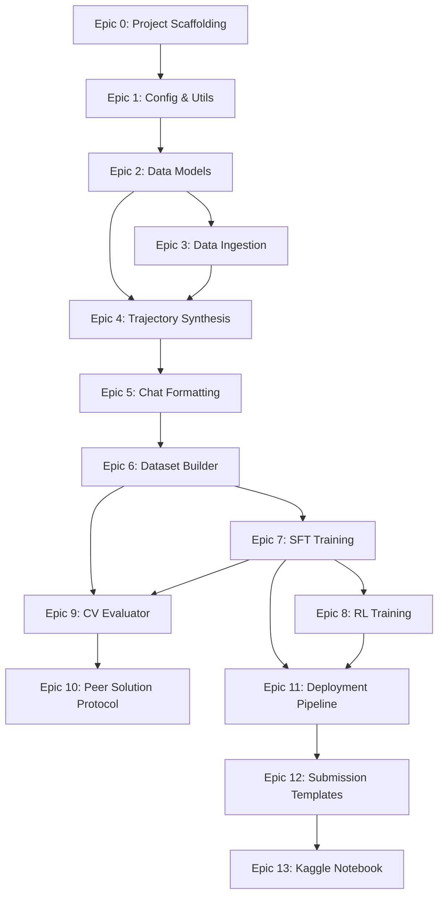

# SweGemma-Agent — Execution Plan Overview

> **This is the master plan document. Each epic has its own detailed plan file.**
> A simpler model can pick up any epic file and execute it independently once its dependencies are met.

---

## Environment

```bash
# Python environment — use this for ALL commands
source ~/python_envs/p312_kaggle/bin/activate

# Working directory
cd /home/somesh/git_repos/gemma4_dev_agent
```

---

## Coding Standards Reference

All code MUST follow: `documentation/prompts/coding_standards.md`

**Critical rules summary for quick reference:**
- Strict OOP: ALL functions inside classes, no free-standing functions
- One class per file, file name matches class name (snake_case)
- Method body ≤ 20 logical lines (HARD LIMIT)
- File ≤ 500 lines
- Member ordering: class vars → `__init__` → public → protected → private
- Type hints on ALL parameters and return types
- Docstrings on every class and public method
- No magic strings/numbers — use class-level `_CONSTANT` for single-class use
- 90%+ test coverage via pytest
- Dependencies injected via constructor
- CI: `ruff check` → `mypy` (strict) → `pytest` (90% coverage)

---

## Epic Dependency Graph



---

## Epic Summary Table

| Epic | Name | Runs On | Depends On | Plan File |
|------|------|---------|------------|-----------|
| 0 | Project Scaffolding | Local | — | [01_project_scaffolding.md](01_project_scaffolding.md) |
| 1 | Config & Utils | Local | Epic 0 | [02_config_and_utils.md](02_config_and_utils.md) |
| 2 | Data Models | Local | Epic 1 | [03_data_models.md](03_data_models.md) |
| 3 | Data Ingestion | Local | Epic 2 | [04_data_ingestion.md](04_data_ingestion.md) |
| 4 | Trajectory Synthesis | Local | Epics 2, 3 | [05_trajectory_synthesis.md](05_trajectory_synthesis.md) |
| 5 | Chat Formatting | Local | Epic 4 | [06_chat_formatting.md](06_chat_formatting.md) |
| 6 | Dataset Builder | Local | Epic 5 | [07_dataset_builder.md](07_dataset_builder.md) |
| 7 | SFT Training | **Server (Kaggle)** | Epic 6 | [08_sft_training.md](08_sft_training.md) |
| 8 | RL Training | **Server (Kaggle)** | Epic 7 | [09_rl_training.md](09_rl_training.md) |
| 9 | CV Evaluator | **Server (Kaggle)** | Epics 6, 7 | [10_cv_evaluator.md](10_cv_evaluator.md) |
| 10 | Peer Solution Protocol | **Server (Kaggle)** | Epic 9 | [11_peer_solution_protocol.md](11_peer_solution_protocol.md) |
| 11 | Deployment Pipeline | Local | Epics 7, 8 | [12_deployment_pipeline.md](12_deployment_pipeline.md) |
| 12 | Submission Templates | Local | Epic 11 | [13_submission_templates.md](13_submission_templates.md) |
| 13 | Kaggle Notebook | **Server (Kaggle)** | Epic 12 | [14_kaggle_notebook.md](14_kaggle_notebook.md) |

---

## Execution Strategy

### Phase A — Local Development (Epics 0–6, 11–12)
All code is written and tested locally with mock data. No GPU required.
These epics produce the `src/` Python package that will be uploaded to Kaggle.

### Phase B — Server Execution (Epics 7–10, 13)
Training, evaluation, and adversarial validation run on Kaggle (4×L4 GPUs).
The code from Phase A is uploaded as a Kaggle dataset and imported by the notebook.

### Key Principle: Local = Code + Mock Tests, Server = Real Training + Eval

---

## Per-Epic Completion Checklist

Every epic is complete when ALL of these pass:

```bash
# Activate env
source ~/python_envs/p312_kaggle/bin/activate

# 1. Lint
cd /home/somesh/git_repos/gemma4_dev_agent && ruff check src/ tests/

# 2. Type check
cd /home/somesh/git_repos/gemma4_dev_agent && mypy src/

# 3. Tests
cd /home/somesh/git_repos/gemma4_dev_agent && pytest tests/ -v --cov=src --cov-report=term-missing
```

> **Note:** The CI commands above use the project root, not `backend/`. The coding standards reference `backend/` but this project does not have a `backend/` directory — adjust accordingly.
